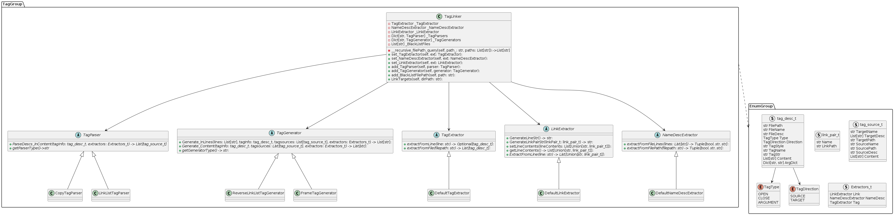

# TagLinker

Simple tag based text generator between markdown files for this repo.


- [Quick Start](#quick-start)
- [Basic Concepts](#basic-concepts)
  * [Extracting Tag Information](#extracting-tag-information)
  * [Processing the Tag Contents](#processing-the-tag-contents)
  * [Generating the Tag Contents](#generating-the-tag-contents)
- [Class Diagram](#class-diagram)


## Quick Start
```python
#!/usr/bin/env python3

from TagLinker import *

if __name__ == "__main__":
    tagLinker = TagLinker()

    tagLinker.set_TagExtractor(DefaultTagExtractor())
    tagLinker.set_NameDescExtractor(DefaultNameDescExtractor())
    tagLinker.set_LinkExtractor(DefaultLinkExtractor())

    tagLinker.add_TagParser(LinkListTagParser())
    tagLinker.add_TagParser(CopyTagParser())

    tagLinker.add_TagGenerator(ReverseLinkListTagGenerator())
    tagLinker.add_TagGenerator(FrameTagGenerator())

    tagLinker.add_BlackListFilePath(
    "docs/Ko/externalSource/TagLinkerReadme/readme.md")

    tagLinker.LinkTargets("docs/Ko")
    pass

```

## Basic Concepts
TagLinker will extract informations from `source` and generate strings to `target`

The tag open and close pair is in form of comment like this : 

```Markdown
# Source
<!-- tag_open_source:tagStyle1:tagName -->
<!-- tag_arg:argName1:argContent -->
<!-- tag_arg:argName2:argContent -->
content1
content2
content3
<!-- tag_close -->

# Target
<!-- tag_open_target:tagStyle2:tagName -->
<!-- tag_arg:argName3:argContent -->
<!-- tag_arg:argName4:argContent -->
generated content1
generated content2
generated content3
<!-- tag_close -->
```

### Extracting Tag Information
TagLinker will firstly extract all tag information in files with `tag_desc_t` struct. It has various fields to describe tag pairs.  
Below is Extractors used in this stage : 
- **LinkExtractor**  
Extract link information from string or generate string with link.  
Now we have DefaultLinkExtrator.
- **NameDescExtractor**  
Extract name of current file  
(different with filename, if the file content starts with # ASDF, then fileName is ASDF).  
Now we have DefaultNameDescExtractor
- **TagExtractor**  
Extract tag info from commented lines. tag is open, closed, target, source, tagName and tagStyle, tag args etc.  
Now we have DefaultTagExtractor

**You can make custom Extractors by inherit abstract classes of each.**

Example: ./asdf/tag_test1.md
```markdown
# filename

filedesc

... 

<!-- tag_open_source:link_list:contrib -->
<!-- tag_arg:preset:presetName -->
<!-- tag_arg:arg1:argv1 -->
- [content111](link1.md)  
content111_desc
- [content222](link2.md)  
<!-- tag_close -->

<!-- tag_open_target:reverse_link_list:contrib -->
<!-- tag_close -->
...
```

```python
# extracted tag_desc_t
{
    FilePath: str = "./asdf/tag_test1.md"
    FileName: str = "filename"
    FileDesc: str = "filedesc"
    Type: TagType = TagType.OPEN
    Direction: TagDirection = TagDirection.SOURCE

    TagStyle: str = "link_list"
    TagName: str = "contrib"
    TagStr: str = "<!-- tag_open:source:link_list:contrib -->"

    Content: List[str] = ["- [content111](link1.md)  \n","content111_desc\n" ..]

    ArgDict: Dict[str, str] = [["preset"]="presetName", ["arg1"]="argv1"]
},
{
    FilePath: str = "./asdf/tag_test1.md"
    FileName: str = "filename"
    FileDesc: str = "filedesc"
    Type: TagType = TagType.OPEN
    Direction: TagDirection = TagDirection.TARGET
    TagStyle: str = "reverse_link_list"
    TagName: str = "contrib"
    TagStr: str = "<!-- tag_open:target:reverse_link_list:contrib -->"
    Content: List[str] = []
    ArgDict: Dict[str, str] = []
},

```


### Processing the Tag Contents
TagLinker will process tag contents(`tag_desc_t`) to `tag_source_t` struct by using different tag exctractors attached. Extracted tag infos will come out as a struct `tag_desc_t`. 

- **TagParser**  
Parse the tag_desc_t into tag_source_t based on tagStyle field.  
Now we have CopyTagParser, LinkListTagParser

**You can make custom Parsers by inherit abstract classes of each.**

Example: 
```python
# processed tag_desc_t above to list of tag_source_t, using 
{
    TargetName: str = "content111"
    TargetDesc: List[str] = ["content111_desc\n"]
    TargetPath: str = "./asdf/link1.md"
    SourceName: str = "filename"
    SourcePath: str = "./asdf/tag_test1.md"
    SourceDesc: str = "filedesc"
    Content: List[str] = ["- [content111](link1.md)  \n","content111_desc\n" ..]
},
{
    TargetName: str = "content222"
    TargetDesc: List[str] = ["content222_desc\n"]
    TargetPath: str = "./asdf/link2.md"
    SourceName: str = "filename"
    SourcePath: str = "./asdf/tag_test1.md"
    SourceDesc: str = "filedesc"
    Content: List[str] = ["- [content111](link1.md)  \n","content111_desc\n" ..]
},
```

Extraction method of tag content into tag_desc_t is determined by tagStyle.  
It is related to TagExtractors classes attached to TagLinker. TagLinker can have multiple TagExtractors so can extract various type of tagStyle contents.


### Generating the Tag Contents
TagLinker will now generate contents between tag_target tag pair. It will using matching TagGenerator with TagStyle.  
Each TagGenerator will use list of tag_source_t. But only with the same TagName will be used to generate contents.

- **TagGenerator**  
Generate the string between tag target comment pair.  
filters list of tag_source_t with tagName, using ones only with same tagName.  
now we have FrameTagGenerator, ReverseLinkListGenerator.

**You can make custom Generators by inherit abstract classes of each.**

Example: file ./asdf/link1.md
```markdown
# content111

link1_desc

<!-- tag_open_target:reverse_link_list:contrib -->
<!-- tag_arg:header:### hhh -->
<!-- tag_arg:list_type:table -->
<!-- tag_arg:table_header: | name | desc | -->
<!-- tag_arg:desc_type:target -->
### hhh
| name | desc |
|[filename](./asdf/tag_test1.md)|content111_desc|
<!-- tag_close -->
```

## Class Diagram
