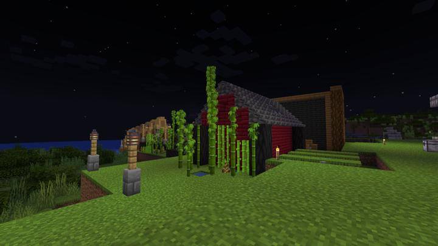

# 답없는 대나무

서버의 대나무의 성장제한이 없어서 방치하면 정말 끝도 없이 자라서 흉물이 된다.

주기적으로 가지를 치던지, 싹을 잘라버리던지 해야된다.

### 참여자
<!-- tag_source_open:description:member_contribute -->
- [happyjourney](../members/happyjourney.md)  
가지 치기 및 관리
<!-- tag_close-->