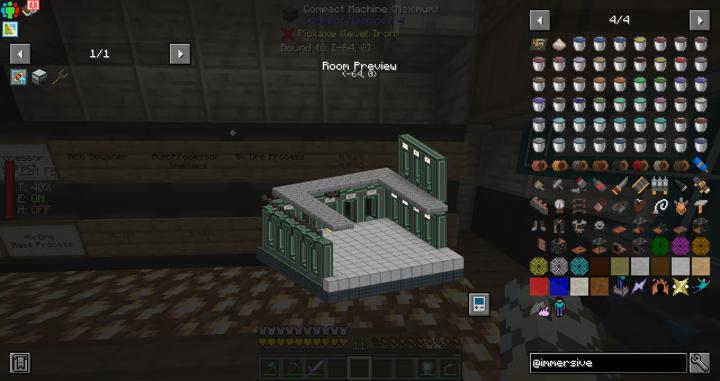

# 컴팩트 머신 차원

한블럭 안의 주머니 차원 & 렉없는 클린 차원

컴팩트 머신은 작은 공간 안에 큰 주머니 차원을 집어넣는 컨셉의 모드이다.
각 크기에 맞는 컴팩트 머신 룸을 조합한 후, personal shrinking device를 통해 방 사이를 왔다갔다 할 수 있다.

하지만 실제로는 인게임에 구현된 방식을 사용하여 렉없는 클린 차원으로 사용하고 있다. 
실제로 사람이 작아지는 것이 아니라, 아예 별도의 차원의 1천 블럭 간격으로 부실 수 없는 방을 만들어 그곳으로 이동하며 눈속임을 하는 구조이기 때문이다.
이 차원에는 주변 지형지물을 비롯한 어떠한 몬스터도 스폰되지 않는 곳이므로 렉으로 부터 클린하며, 청크 로딩을 걸어도 서버에 큰 부하를 주지 않는다. 

또한, 텔레포터나 waystone 등의 텔레포트 기능을 사용하면 언제든 들어올 수 있으므로, 보호되어야 하거나 이동이 잦은 시설들은 아예 이곳이 두는것이 제일 좋다.

**요약하자면 다음과 같은 장점이 있다.**
- 차원 자체가 가벼워 렉없는 클린한 차원
- 서버에 부하를 주는 대량 공정 또는 자동화 시설 장소로 적합
- 이동하기 힘든 시설을 따로 관리하고 싶을 때

현재는 RS의 대형 공정, 대량의 몹이 발생하는 몹 농장 등이 위치해 있으며, 이 사이를 왔다갔다 하기 편하도록 텔레포터 허브를 따로 두어 방 사이의 이동을 편하게 했다.

## 타 문서와의 관계
<!-- ### 상위 장소 -->
<!-- tag_source_open:link_list:child_spot -->
<!-- tag_close -->

<!-- ### 하위 장소 목록 -->
<!-- tag_target_open:reverse_link_list:child_spot -->
<!-- tag_arg:preset:spots_inside -->
<!-- tag_close -->

<!-- 보유 시설 목록 -->
<!-- tag_target_open:reverse_link_list:building_spot -->
<!-- tag_arg:preset:systems_inside -->
### 보유 시설 목록
|시설|세부 사항|
|---|---|
|[광물 정제 플랜트 - 5배](../systems/mk_ore_processing_plant_5x.md)|텔레포터 허브를 통해 이동할 수 있다.|
|[리파인드 스토리지 네트워크 트랜젝션](../systems/rs_network_tranjection.md)|텔레포트 허브를 통해 이동할 수 있다.|
|[리파인드 스토리지 디스크 드라이브 룸](../systems/rs_disk_drives.md)|텔레포트 허브를 통해 이동할 수 있다.  |
|[리파인드 스토리지 블랙홀 룸](../systems/rs_black_hole.md)|텔레포터 허브를 통해 이동할 수 있다.|
|[리파인드 스토리지 재고 제어](../systems/rs_stock_control.md)|텔레포트 허브를 통해 이동할 수 있다.|
|[리파인드 스토리지 크래프터 룸](../systems/rs_crafters.md)|텔레포터 허브를 통해 이동 가능|
|[메카니즘 인덕션 메트릭스](../systems/mk_induction_matrix.md)|텔레포터 허브로 이동할 수 있다.|
|[메카니즘 자동 병렬 스멜터](../systems/mk_auto_smeltery.md)|288스레드의 대형 공정이 위치해있다.|
|[메카니즘 자동 병렬 인리치멘트 체임버](../systems/mk_auto_enrichment_chamber.md)|288스레드 대형 공정이 위치해있다.|
|[메카니즘 자동 병렬 크러셔](../systems/mk_auto_crushers.md)|288스레드의 대형 공정이 위치함.|
|[몹 스포터 농장](../systems/mobspawner_farm.md)|텔레포터 허브로 이동할 수 있다.|
|[써멀 익스팬션 자동 스톤 익스트루더](../systems/te_stone_extruder.md)|텔레포트 허브를 통해 이동할 수 있다.|
|[자동 몹 농장](../systems/auto_mob_farm.md)|텔레포터 허브를 통해 이동할 수 있다.|
|[크리에이트 자동 공정 룸](../systems/create_auto_factory.md)|텔레포터 허브를 통해 이동할 수 있다.|
|[텔레포터 트랜잭션](../systems/teleporter_hub.md)|컴팩트 머신 간의 이동을 돕는다|
<!-- tag_close -->
