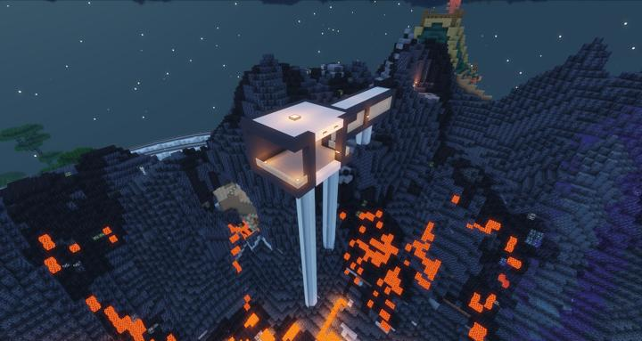
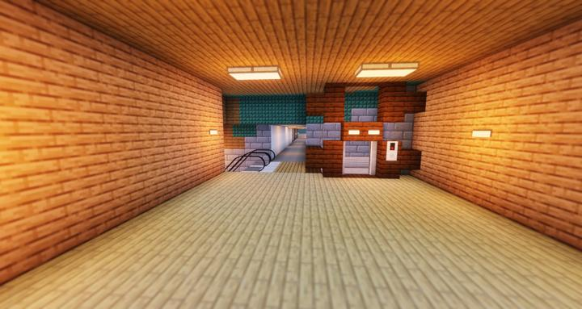
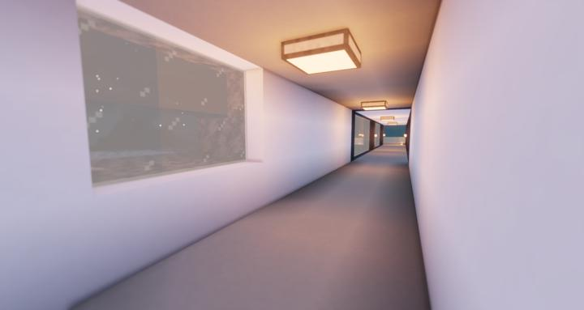
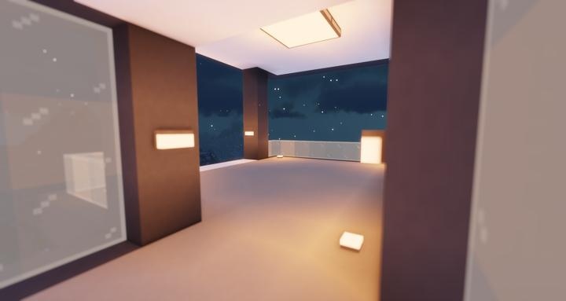
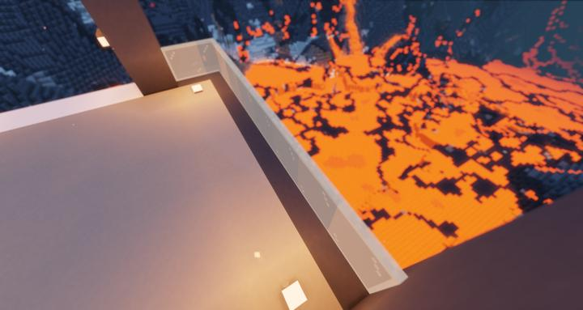

# 크라시움 모노레일

화산을 한바퀴 돌며 구경할 수 있는 모노레일

볼케이노 바이옴을 현수 모노레일을 타서 이동하며 관람할 수 있다.

크라시움 역의 2층에서 복도를 통해 갈 수 있으며, 용암 바다를 한눈에 볼 수 있는 정거장과, 모노레일을 탈 수도 있다.

## 업데이트 내역
### 2023-06-18 정거장 추가

:::details 사진들
지어진 정거장 오버뷰  

역 안에서의 입구  

정거장으로 가는 복도  

정거장의 모습  

아래로 보이는 용암 바다  

:::

## 타 문서와의 관계
### 상위 장소
<!-- tag_source_open:link_list:child_spot -->
- [순환 철도 - 크라시움](../buildings/ocr_cratium.md)
<!-- tag_close -->

<!-- ### 하위 장소 목록 -->
<!-- tag_target_open:reverse_link_list:child_spot -->
<!-- tag_arg:preset:spots_inside -->
<!-- tag_close -->

<!-- 보유 시설 목록 -->
<!-- tag_target_open:reverse_link_list:building_spot -->
<!-- tag_arg:preset:systems_inside -->
<!-- tag_close -->

### 참여자
<!-- tag_source_open:link_list:member_contribute -->
- [jasuk500](../members/jasuk500.md)  
모노레일 승강장, 다리, 레일 건설
<!-- tag_close-->