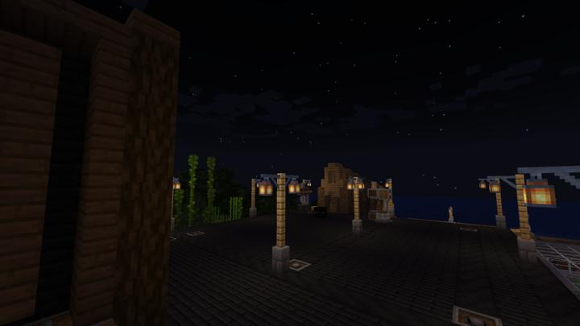

# Create 플랫폼

Create 시스템을 위한 모듈러 동력 전달 플랫폼.

지하에 수력 발전기 & 스팀 터빈과 메인 동력축을 연결해서, 모듈러 식으로 다양한 Create 시스템들을 구현할 수 있도록 만든 플랫폼이다.

### 상위 장소
<!-- tag_source_open:link_list:child_spot -->
- 길드 주변
<!-- tag_close -->

<!-- ### 하위 장소 목록 -->
<!-- tag_target_open:reverse_link_list:child_spot -->
<!-- tag_arg:preset:spots_inside -->
<!-- tag_close -->

<!-- 보유 시설 목록 -->
<!-- tag_target_open:reverse_link_list:building_spot -->
<!-- tag_arg:preset:systems_inside -->
### 보유 시설 목록
|시설|세부 사항|
|---|---|
|[Create 메카니컬 조합기](../systems/create_mechanical_crafter.md)||
|[Create 반자동 안산암 합금 생성기](../systems/create_semiauto_andesite_alloy_maker.md)||
|[Create 반자동 정밀기계 생성기](../systems/create_semiauto_refinedmachine_generator.md)||
|[Create 철조각 및 부싯돌 생성 공장](../systems/create_iron_flint_steal_factory.md)||
|[Create 케이스 생산 라인](../systems/create_case_line.md)||
|[철도 생성기](../systems/rail_generator.md)||
<!-- tag_close -->

### 참여자
<!-- tag_source_open:link_list:member_contribute -->
- [happyjourney](../members/happyjourney.md)  
건축
<!-- tag_close-->