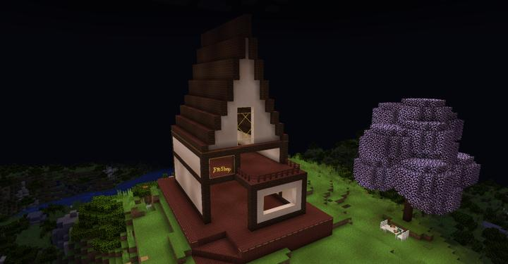
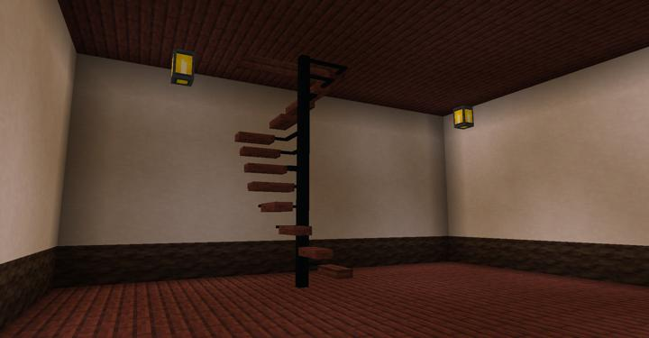
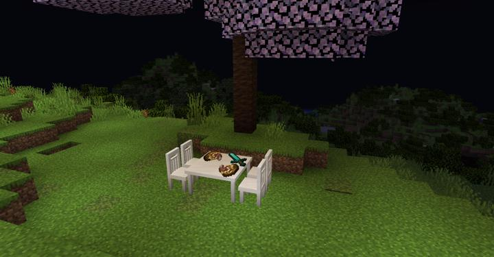

# ETC Shop

치즐로 빚은 높은 퀄리티의 잡화점이다

길드에서 열차 타고 가면 바로 볼 수 있다. 

다양한 곳에 치즐을 사용하여 높은 디테일을 구현했다.

## 업데이트 내역
### 2023-06-24 외관 공사

:::details 사진들
잡화점 건물 외형이랑 계단  
  

누가 남의 집 마당에 먹다 남은 피자랑 칼 버리고 감  

:::

## 타 문서와의 관계
### 상위 장소
<!-- tag_source_open:link_list:child_spot -->
- 길드 주변
<!-- tag_close -->

<!-- ### 하위 장소 목록 -->
<!-- tag_target_open:reverse_link_list:child_spot -->
<!-- tag_arg:preset:spots_inside -->
<!-- tag_close -->

<!-- 보유 시설 목록 -->
<!-- tag_target_open:reverse_link_list:building_spot -->
<!-- tag_arg:preset:systems_inside -->
<!-- tag_close -->

### 참여자
<!-- tag_source_open:link_list:member_contribute -->
- [JJIN27](../members/JJIN27.md)  
건축
<!-- tag_close-->