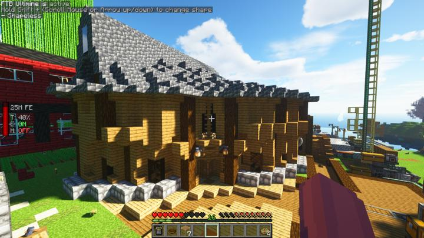
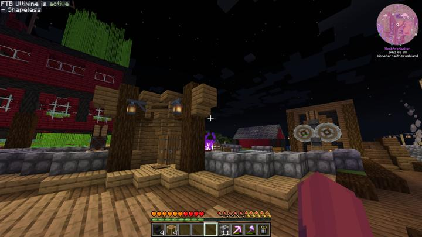
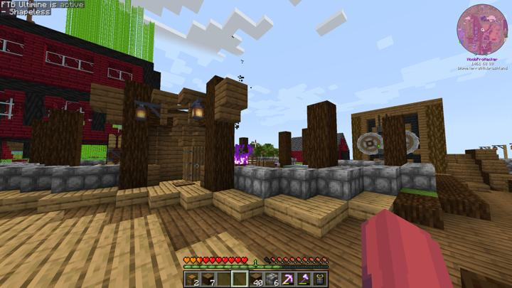
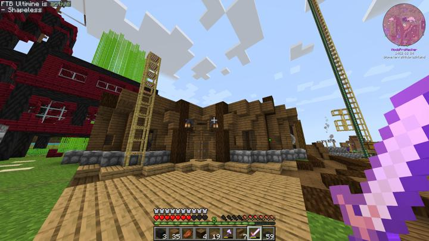
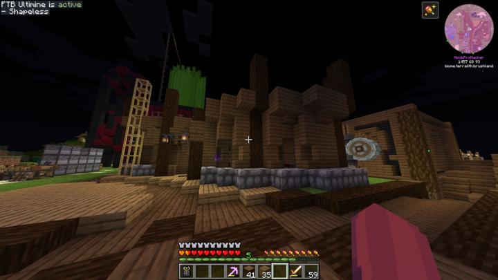
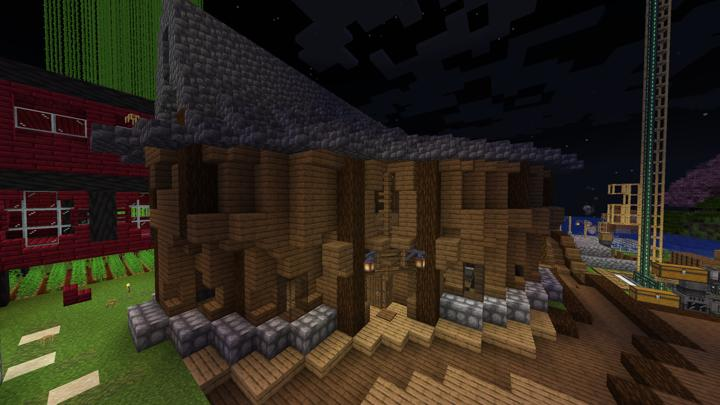
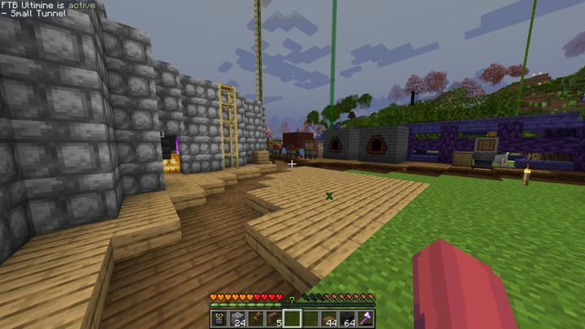

# 길드 하우스

길드의 메인 하우스. 모두의 침대가 위치해 있다.

디자인적으로는 만족하지만 그에따른 복잡한 내부구조로 보기에만 예쁜 건물이 되어 버렸다.
"???:죽으면 저건물에서 부활해서 죽기 무서워""

### 건축 과정

지반만 다진 상태

기둥 세운 다음

1층 벽 만든 상태

2층 기둥 세운 상태

2층 벽과 지붕 씌워서 완성

### 길드 하우스 초창기의 길

## 타 문서와의 관계
### 상위 장소
<!-- tag_source_open:link_list:child_spot -->
- 오버월드
<!-- tag_close -->

<!-- ### 하위 장소 목록 -->
<!-- tag_target_open:reverse_link_list:child_spot -->
<!-- tag_arg:preset:spots_inside -->
<!-- tag_close -->

<!-- ### 보유 시설 목록 -->
<!-- tag_target_open:reverse_link_list:building_spot -->
<!-- tag_arg:preset:systems_inside -->
<!-- tag_close -->

### 참여자
<!-- tag_source_open:link_list:member_contribute -->
- [happyjourney](../members/happyjourney.md)  
건축
<!-- tag_close-->