# 개인 주택 - jasuk500

jasuk500의 개인 모던하우스 주택

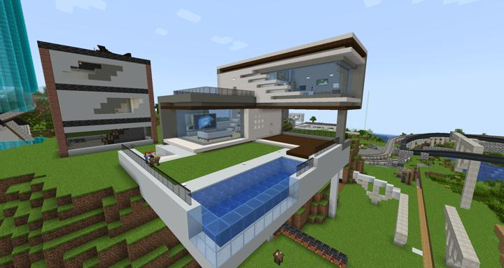

jasuk500의 개인 주택으로, 여러가지 디자인을 합쳐 만들었다.

## 업데이트 내역
### 2023-05-21 인테리어 및 조명 공사

서버에 3차로 새로운 [데코 관련 모드](../history/history.md#history_3rd_mod_add)가 들어옴에 따라 천장의 라이팅과 가구가 바뀌었다. 

내부 가구는 Cookinng For Blockheads라는 모드의 멀티블럭 주방을 사용하여 실제로 요리가 가능하도록 설계됐다. 

:::details 세부 내용

들어가는 문, framed door에 connected light gray glass 를 입힌 것이다.
위에는 guages and switches 모드의 door detector로 자동으로 사람을 감지하여 문을 열어준다.   
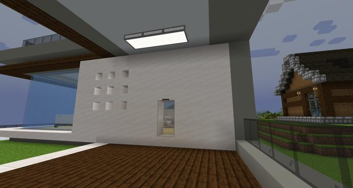

부엌의 모습. Cooking For blockheads 모드를 사용하여 요리를 만들 수 있다.  
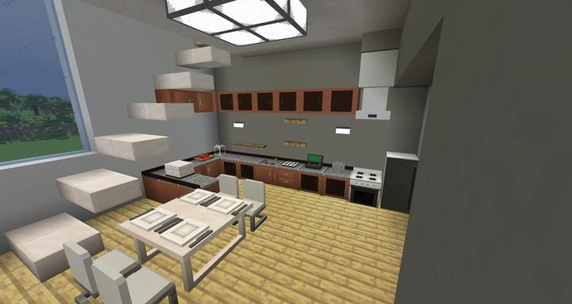

거실의 모습. computercraft 모드로 tv처럼 움직이도록 사진5개를 연속으로 그려서 움직이는 것처럼 만들었다. 
원본 사진을 컴퓨터크래프트용 그림으로 만들어주는 간단한 [오픈소스](https://github.com/DownrightNifty/computercraft-stuff)를 사용하여 만들었다.

움직이는 화면은 추후에 추가하겠다.  
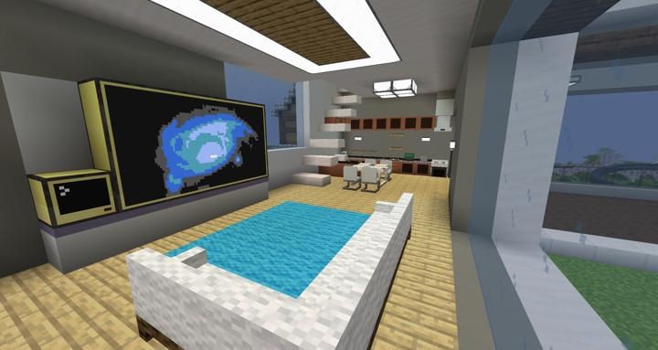
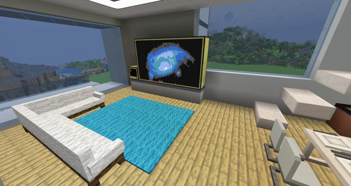

TV에 나오는 화면의 원본 이미지는 원랜 이렇다.  
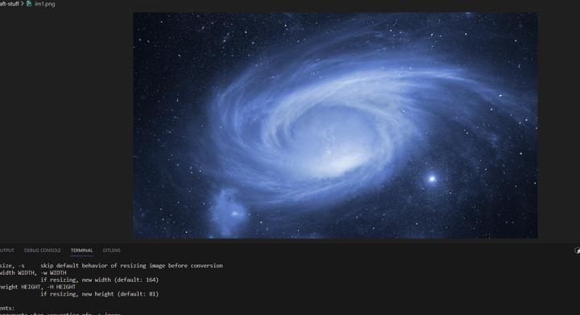

한때 페페짤이었지만 분위기를 너무 해쳐서 도로 바꾼것이다.  
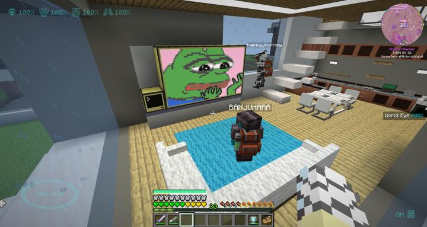

석영 반블럭으로 2층으로 올라가는 계단  
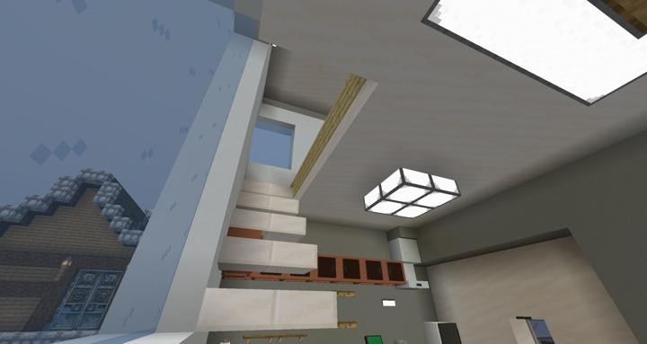

2층 서재  
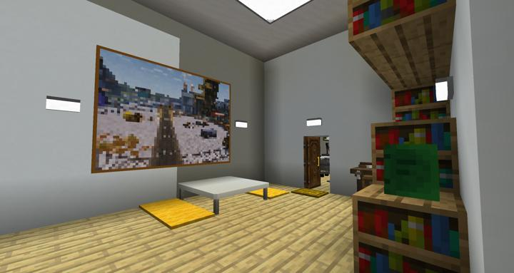
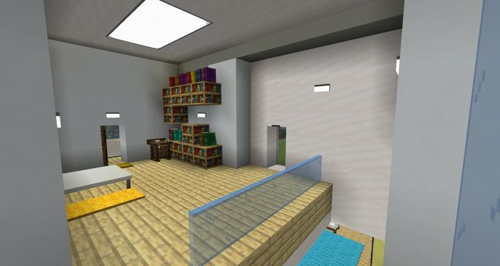

2층 내 방의 모습.  
chisel 모드로 비트로 깎아서 모니터, 키보드 마우스를 그렸다. 
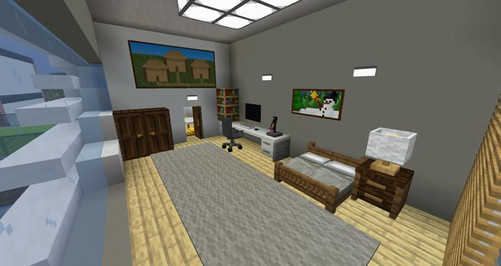
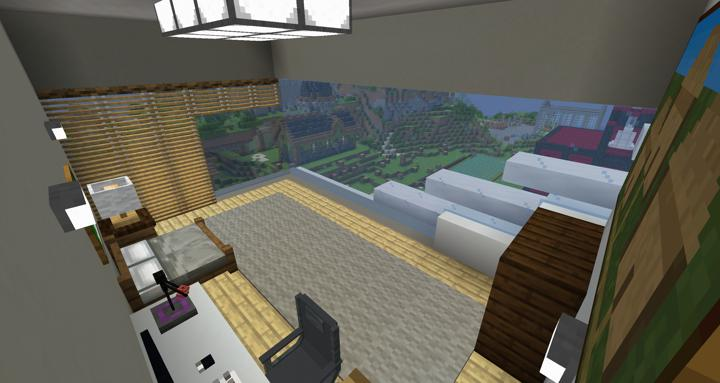
:::

### 2023-05-11 외관 공사

마을 중앙 언덕 위에 모던 하우스 집을 짓기 시작했다. 

인터넷에서 모던 하우스 건축 양식 몇개를 섞어서 만들었으며, 공간이 모자라 절벽에 기둥을 만들어 옆으로 늘렸다.

주재료는 white concrete, light gray concrete, smooth quartz 등이다. 

:::details 사진들
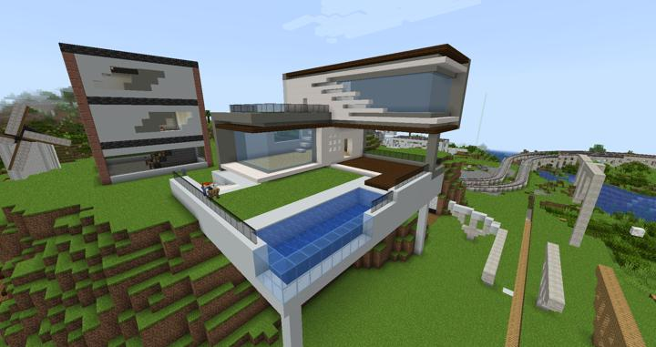

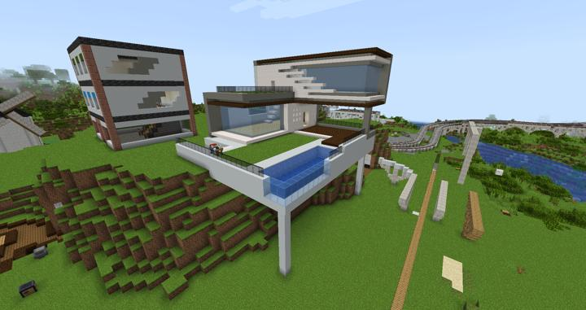

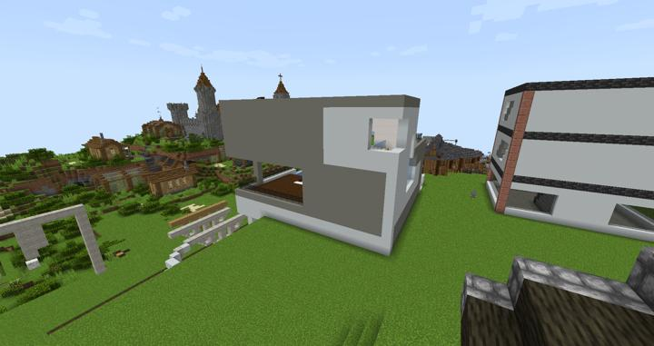

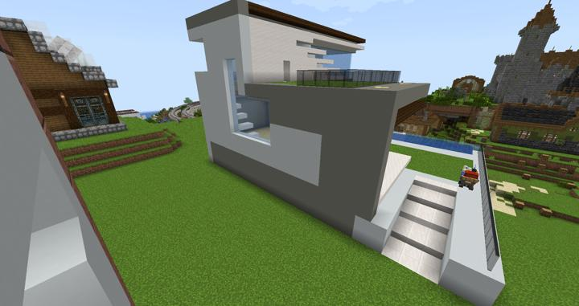

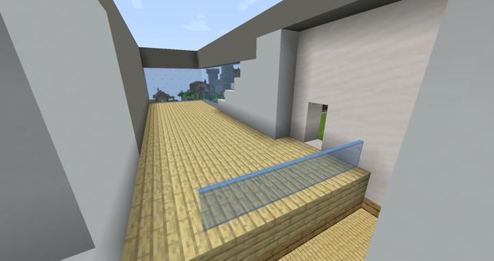

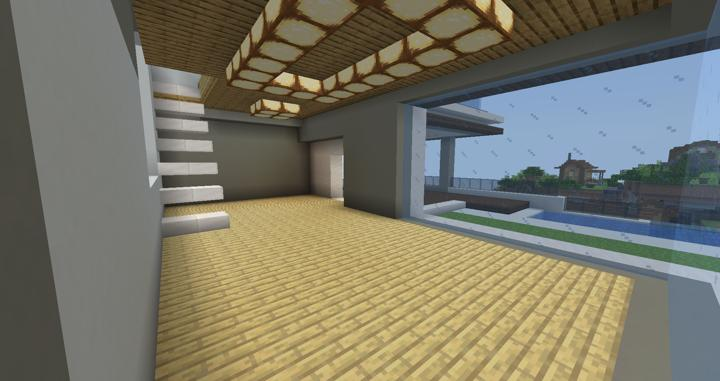

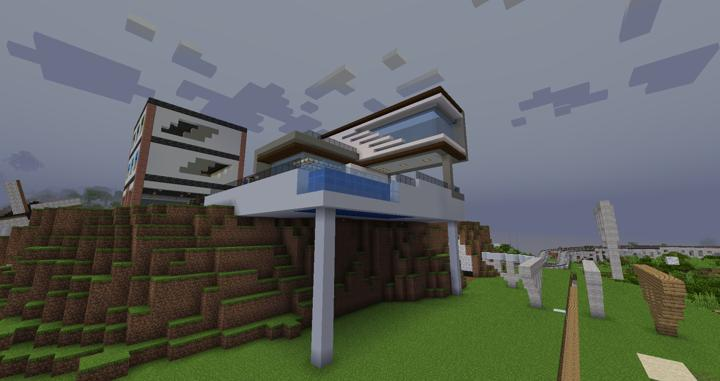
:::

## 타 문서와의 관계
### 상위 장소
<!-- tag_source_open:link_list:child_spot -->
- 길드 주변
<!-- tag_close -->

<!-- ### 하위 장소 목록 -->
<!-- tag_target_open:reverse_link_list:child_spot -->
<!-- tag_arg:preset:spots_inside -->
<!-- tag_close -->

<!-- ### 보유 시설 목록 -->
<!-- tag_target_open:reverse_link_list:building_spot -->
<!-- tag_arg:preset:systems_inside -->
<!-- tag_close -->

### 참여자
<!-- tag_source_open:link_list:member_contribute -->
- [jasuk500](../members/jasuk500.md)  
건축
<!-- tag_close-->