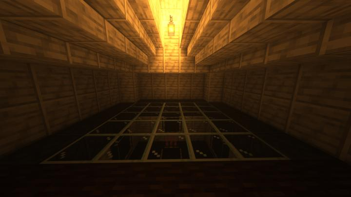

# 인벤토리의 제단

초반 인벤의 통합을 가능하게 한 오큘러스의 저장소가 위치했던 방

2칸 깊이+유리로 막혀있어 업그레이드 할 때마다 매번 유리를 깨고 다시 덮었다.

지금은 사용하지 않지만, 부시기도 뭐해서 냅둔 상태다.

### 상위 장소
<!-- tag_source_open:link_list:child_spot -->
- 길드 지하 2층
<!-- tag_close -->

<!-- ### 하위 장소 목록 -->
<!-- tag_target_open:reverse_link_list:child_spot -->
<!-- tag_arg:preset:spots_inside -->
<!-- tag_close -->

<!-- ### 보유 시설 목록 -->
<!-- tag_target_open:reverse_link_list:building_spot -->
<!-- tag_arg:preset:systems_inside -->
### 보유 시설 목록
|시설|세부 사항|
|---|---|
|[오컬티즘 매직 스토리지](../systems/occultism_magic_storage.md)|아이템 네트워크를 사용한 대량 아이템 스토리지.|
<!-- tag_close -->

### 참여자
<!-- tag_source_open:link_list:member_contribute -->
- [happyjourney](../members/happyjourney.md)  
건축
<!-- tag_close-->