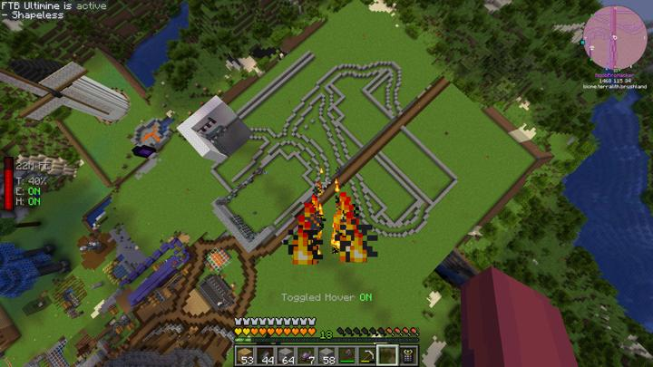

# 연구소 - 메인

언덕 지하에 있는 연구소 단지.

다양한 연구 시설들이 지하에 위치해 있다.

## 비하인드

lab의 비밀 랩의 길은 사실 π모양으로 되어있었다.

## 타 문서와의 관계
### 상위 장소
<!-- tag_source_open:link_list:child_spot -->
- 길드 주변
<!-- tag_close -->

<!-- ### 하위 장소 목록 -->
<!-- tag_target_open:reverse_link_list:child_spot -->
<!-- tag_arg:preset:spots_inside -->
### 하위 장소 목록
|시설|세부 사항|
|---|---|
|[연구소 - 메카](lab_meka_lab.md)|메카니즘 및 리파인드 스토리지를 담당하는 연구실|
|[연구소 - 천연 연못](lab_pond.md)|연구소 내부의 연못.|
<!-- tag_close -->

<!-- ### 보유 시설 목록 -->
<!-- tag_target_open:reverse_link_list:building_spot -->
<!-- tag_arg:preset:systems_inside -->
<!-- tag_close -->

### 참여자
<!-- tag_source_open:link_list:member_contribute -->
- [happyjourney](../members/happyjourney.md)  
건축
<!-- tag_close-->