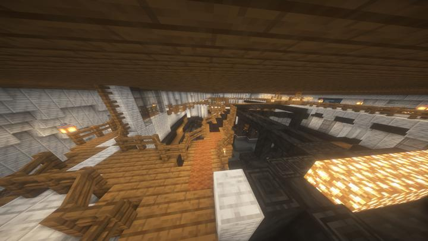

# 연구소 - 다리

랩의 여러공간을 이어주는 다리이다.

디자인적 요소와 이동의 편리성 두 요소를 중시해서 만들었다.

## 타 문서와의 관계
### 상위 장소
<!-- tag_source_open:link_list:child_spot -->
- [연구소 - 메인](lab.md)
<!-- tag_close -->

<!-- ### 하위 장소 목록 -->
<!-- tag_target_open:reverse_link_list:child_spot -->
<!-- tag_arg:preset:spots_inside -->
<!-- tag_close -->

<!-- ### 보유 시설 목록 -->
<!-- tag_target_open:reverse_link_list:building_spot -->
<!-- tag_arg:preset:systems_inside -->
<!-- tag_close -->

### 참여자
<!-- tag_source_open:link_list:member_contribute -->
- [happyjourney](../members/happyjourney.md)  
건축
<!-- tag_close-->