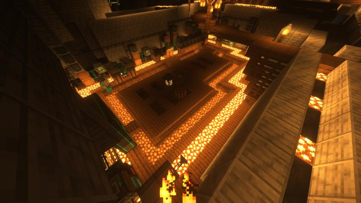
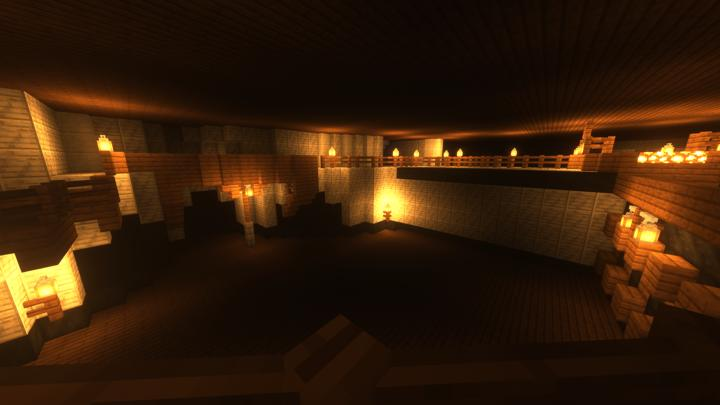

# 연구소 - 메카

메카니즘 및 리파인드 스토리지를 담당하는 연구실

자칫 너무 차가워 보일수 있는 연구소의 바닥을 목재로 마감하여 따뜻한 느낌을 주려 함.

현재 남은 방이 하나 있어서 기계들의 입주를 기다리는 중이다.

"???:벽 뚫자 !!!:아니 거기는!!ㅠㅠ" 

## 타 문서와의 관계
### 상위 장소
<!-- tag_source_open:link_list:child_spot -->
- [연구소 - 메인](lab.md)
<!-- tag_close -->

<!-- ### 하위 장소 목록 -->
<!-- tag_target_open:reverse_link_list:child_spot -->
<!-- tag_arg:preset:spots_inside -->
<!-- tag_close -->

<!-- ### 보유 시설 목록 -->
<!-- tag_target_open:reverse_link_list:building_spot -->
<!-- tag_arg:preset:systems_inside -->
### 보유 시설 목록
|시설|세부 사항|
|---|---|
|[리파인드 스토리지 (메인)](../systems/rs_main.md)||
|[메카니즘 자동 메탈러직 인퓨져](../systems/mk_auto_metallurgic_infuser.md)||
|[메카니즘 자동 병렬 스멜터](../systems/mk_auto_smeltery.md)|지금은 규모가 커져 컴팩트 머신 차원으로 옮겨졌다.|
|[메카니즘 자동 병렬 인리치멘트 체임버](../systems/mk_auto_enrichment_chamber.md)|지금은 이곳에서 규모가 커짐에 따라 컴팩트 머신 차원으로 옮겼다|
|[메카니즘 자동 병렬 크러셔](../systems/mk_auto_crushers.md)|지금은 컴팩트 머신 차원으로 옮겨졌다.|
|[메카니즘 자동 컴프레싱 머신](../systems/mk_auto_compressing.md)||
|[써멀 익스팬션 자동 마그마 크루시블](../systems/te_auto_magma_crucible.md)||
|[써멀 익스팬션 자동 멀티서보 프레스](../systems/te_auto_multiservo_press.md)||
|[써멀 익스팬션 자동 인덕션 스멜터](../systems/te_auto_induction_smelter.md)||
|[써멀 익스팬션 자동 플루이드 인캡슐레이터 - 물](../systems/te_auto_fluid_encapsulator_water.md)||
|[에틸렌 발전소](../systems/mk_ethylene_generator.md)||
|[컴팩트 머신 메인](../systems/cm_compactmachine_main.md)|RS 시설 바로 옆에 위치하고 있다.|
<!-- tag_close -->

### 참여자
<!-- tag_source_open:link_list:member_contribute -->
- [happyjourney](../members/happyjourney.md)  
건축
<!-- tag_close-->