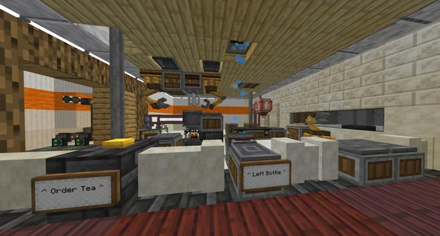
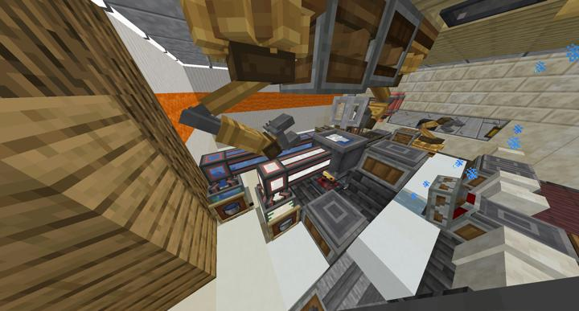
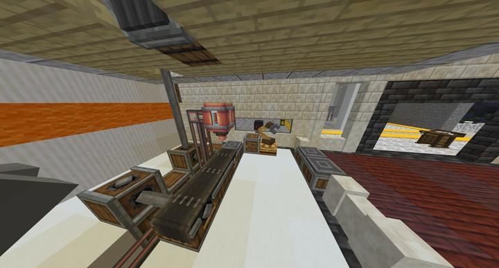
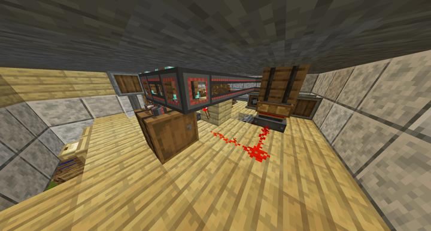
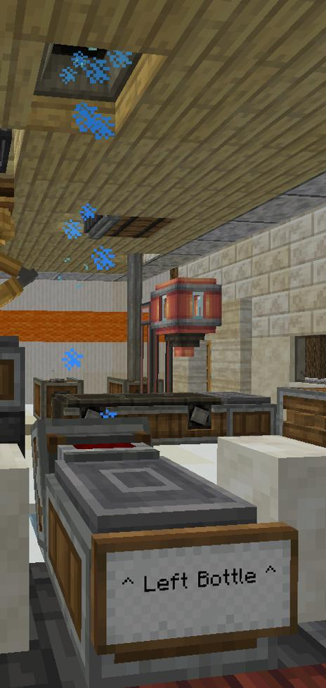

# 러쉬 스택 무인 카페

컬쳐 스페이스에 위치한 원버튼 로봇 자동 무인 카페

Lushstack 상가층의 무인 카페.
왼쪽의 주문 버튼을 누르면 차 제조부터 서빙까지 자동으로 이뤄진다.
위에서 Depot으로 재료인 나뭇잎과 블레이즈 버너의 연료인 석탄 조각이 떨어지고, 기계 팔이 아이템들을 공급해준다. 

**무인카페 서빙 영상**  
<iframe width="560" height="315" src="https://www.youtube.com/embed/O0NZVcidVtA" title="YouTube video player" frameborder="0" allow="accelerometer; autoplay; clipboard-write; encrypted-media; gyroscope; picture-in-picture; web-share" allowfullscreen></iframe>

RS를 이용하면 액체 제어까지 가능하지만, 처음에 지어놓은 공간이 좁고 너무 많은 공정을 때려넣으면 제조 과정이 알아보기 힘들기 때문에 물과 우유는 상시 공급된다.
물은 Sink, 우유는 Cow in a Jar를 이용해 생산중.

제조가 끝난 건축가의 차는 Spout으로 공급되며, 버튼을 눌렀을 때 함께 벨트로 떨어지는 유리병 2개에 내용물을 담게 된다.
모든 프로세스가 완료되면 기계 팔이 카운터로 서빙하게 된다.

무인 카페의 제어 시스템. 버튼을 누르면 레드스톤 신호가 잠깐 끊기면서 Smart Chute가 작동하게 되고, 설정한 개수만큼의 재료를 공급한다.
Left Bottle Depot에 남은 유리병을 올리면 자동으로 세척하여 보관소로 수납하게 되는 컨셉.
  

  

## 타 문서와의 관계
### 상위 장소
<!-- tag_source_open:link_list:child_spot -->
- [순환 철도 - 러쉬 스택](ocr_lush_stack.md)
<!-- tag_close -->

<!-- ### 하위 장소 목록 -->
<!-- tag_target_open:reverse_link_list:child_spot -->
<!-- tag_arg:preset:spots_inside -->
<!-- tag_close -->

<!-- ### 보유 시설 목록 -->
<!-- tag_target_open:reverse_link_list:building_spot -->
<!-- tag_arg:preset:systems_inside -->
<!-- tag_close -->

### 참여자
<!-- tag_source_open:link_list:member_contribute -->
- [BANJUHARA](../members/BANJUHARA.md)  
카페 데코 / 설계 및 영상 촬영
<!-- tag_close-->