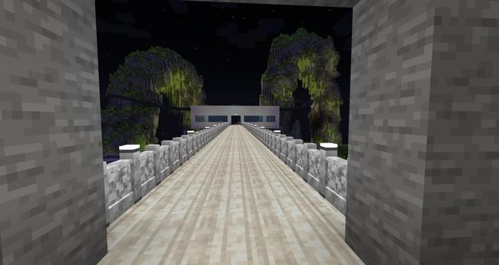
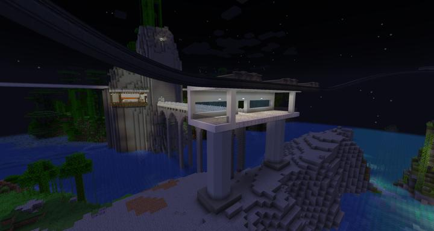
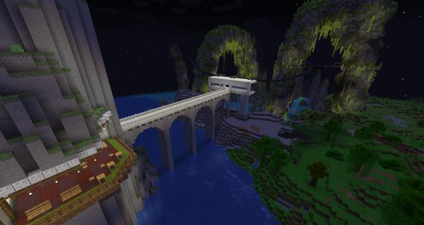
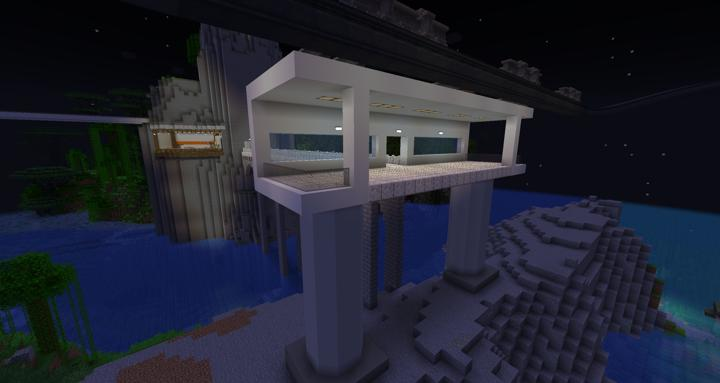
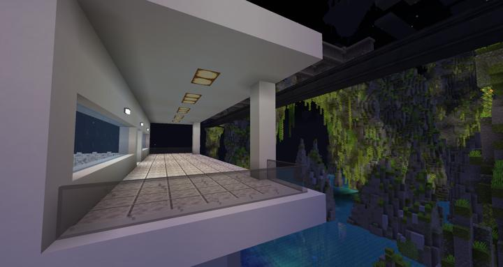
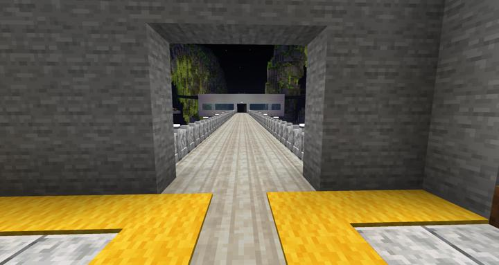
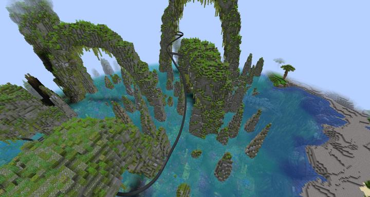
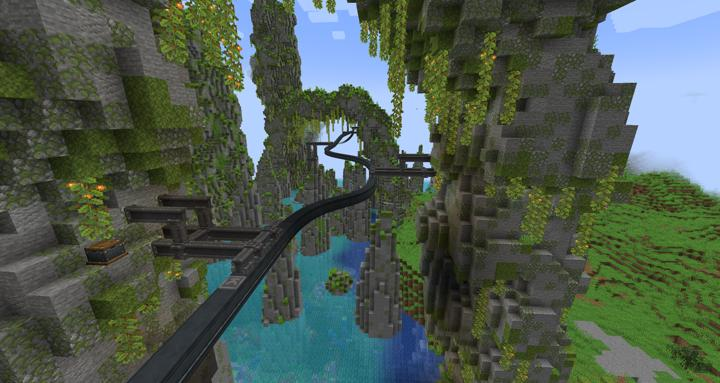
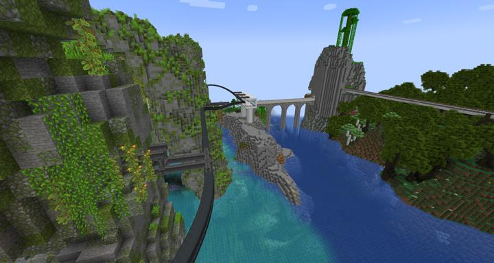

# 러쉬 스택 모노레일

러쉬 스택 지역을 가까이서 볼 수 있는 모노레일

오버월드 순환 철도를 타고 러쉬 스택 역에서 내려서 다리를 건너 정거장으로 이동할 수 있으며,
러쉬 스택 바이옴을 현수 모노레일로 가까이서 관람할 수 있다.

이 과정에서 [불가능한 레시피 : 모노레일 사태](../history/history.md#imposible_recipe)가 터져서 한바탕 소동이 일었다. 

Create 모드의 Girder를 사용하여 벽에 앵커를 박아 레일이 단단히 고정된 느낌을 주었다. 
높은곳 부터 물 위로 아슬아슬한 높이까지 최대한 다양한 뷰를 보여준다. 

## 업데이트 내역
### 2023-05-21 교량 및 모노레일 레일 추가

:::details 러쉬스택 컬쳐 스페이스에서 레일 정거장 까지 가는 다리

:::

:::details 러쉬스택 모노레일 레일과 앵커

:::

## 타 문서와의 관계
### 상위 장소
<!-- tag_source_open:link_list:child_spot -->
- [순환 철도 - 러쉬 스택](ocr_lush_stack.md)
<!-- tag_close -->

<!-- ### 하위 장소 목록 -->
<!-- tag_target_open:reverse_link_list:child_spot -->
<!-- tag_arg:preset:spots_inside -->
<!-- tag_close -->

<!-- 보유 시설 목록 -->
<!-- tag_target_open:reverse_link_list:building_spot -->
<!-- tag_arg:preset:systems_inside -->
<!-- tag_close -->

### 참여자
<!-- tag_source_open:link_list:member_contribute -->
- [jasuk500](../members/jasuk500.md)  
모노레일 승강장, 다리 건설
<!-- tag_close-->