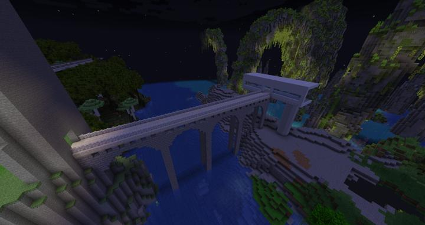

# 러쉬 스택 모노레일

러쉬 스택 지역을 가까이서 볼 수 있는 모노레일

오버월드 순환 철도를 타고 러쉬 스택 역에서 내려서 다리를 건너 정거장으로 이동할 수 있다.

러쉬 스택 바이옴을 현수 모노레일을 타서 이동하며 관람할 수 있다.

현재 계속 건설 중에 있다.

### 상위 장소
<!-- tag_source_open:link_list:child_spot -->
- [순환 철도 - 러쉬 스택](ocr_lush_stack.md)
<!-- tag_close -->

<!-- ### 하위 장소 목록 -->
<!-- tag_target_open:reverse_link_list:child_spot -->
<!-- tag_arg:preset:spots_inside -->
<!-- tag_close -->

<!-- 보유 시설 목록 -->
<!-- tag_target_open:reverse_link_list:building_spot -->
<!-- tag_arg:preset:systems_inside -->
<!-- tag_close -->

### 참여자
<!-- tag_source_open:link_list:member_contribute -->
- [jasuk500](../members/jasuk500.md)  
모노레일 승강장, 다리 건설
<!-- tag_close-->