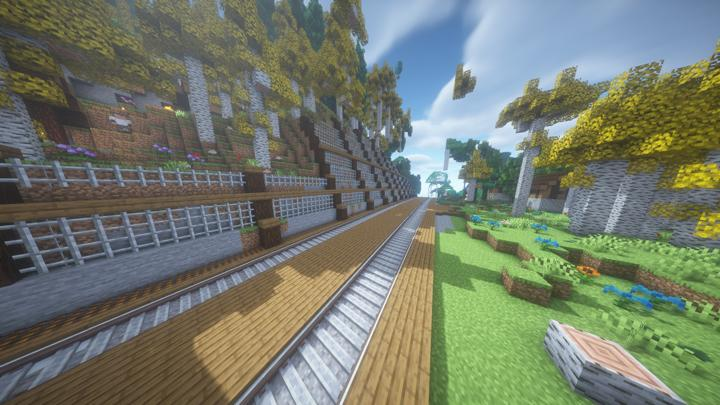

# 아스펜 정거장

스파크 타이드와 크라시움 역 사이의 작은 정거장

소형 역
딱히 역사는 지어지지 않았다.

옆 산을 깍아내서 토사가 흘러내리는 것을 막기 위한 펜스와 망이 설치되어 있다.
근처에 마을이 있다.

FrameBlock의 블럭을 활용하여 기찻길을 일체감있게 꾸몄다.

## 타 문서와의 관계
### 상위 장소
<!-- tag_source_open:link_list:child_spot -->
- [오버월드 순환 철도](overworld_circular_railway.md)
<!-- tag_close -->

<!-- ### 하위 장소 목록 -->
<!-- tag_target_open:reverse_link_list:child_spot -->
<!-- tag_arg:preset:spots_inside -->
<!-- tag_close -->

<!-- ### 보유 시설 목록 -->
<!-- tag_target_open:reverse_link_list:building_spot -->
<!-- tag_arg:preset:systems_inside -->
<!-- tag_close -->

### 참여자
<!-- tag_source_open:link_list:member_contribute -->
- [happyjourney](../members/happyjourney.md)  
깃발꽃기
<!-- tag_close-->