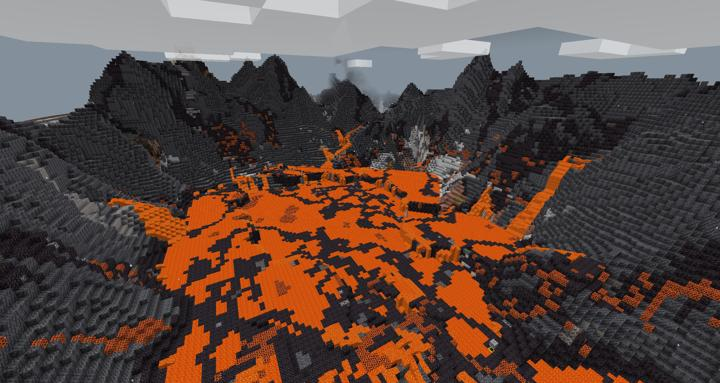
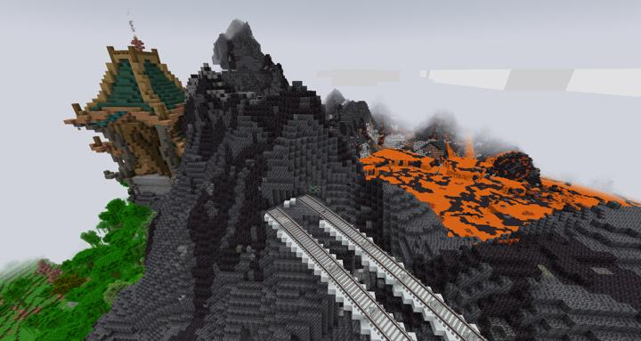
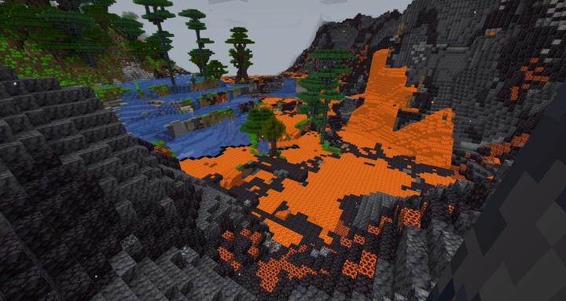

# 순환 철도 - 크라시움

세상에서 제일 큰 화산과 대수층

<!-- tag_target_open:frame:overworld_circular_rail -->
:::tip 오버월드 순환 철도 노선도
[오버월드 순환 철도](overworld_circular_railway.md)의 모든 역 목록

[길드](ocr_the_guild.md) -> [러쉬 스택](ocr_lush_stack.md) -> [스파크 타이드](ocr_spark_tide.md) -> [크라시움](ocr_cratium.md) -> ...
:::
<!-- tag_close -->

현재 오버월드에서 발견된 가장 큰 화산 분화구와, 옆에 3층으로 이루어진 대수층 지형이 결합된 특이한 형태.

y좌표가 거의 150으로 매우 높은 지형이다. 바로 위에 구름이 지나간다. 

현재 철도만 이어져 있는 형태이며, 나중에 역과 모노레일을 추가하여 화산 내부를 구경할 수 있게 만들 예정이다.

:::details 사진들

깔리고 있는 레일  

물과 용암이 같이 있는 특이한 바이옴  

:::

## 타 문서와의 관계
<!-- ### 상위 장소 -->
<!-- tag_source_open:link_list:child_spot -->
<!-- tag_close -->

<!-- ### 하위 장소 목록 -->
<!-- tag_target_open:reverse_link_list:child_spot -->
<!-- tag_arg:preset:spots_inside -->
<!-- tag_close -->

<!-- 보유 시설 목록 -->
<!-- tag_target_open:reverse_link_list:building_spot -->
<!-- tag_arg:preset:systems_inside -->
<!-- tag_close -->

### 참여자
<!-- tag_source_open:link_list:member_contribute -->
- [jasuk500](../members/jasuk500.md)  
레일 배치
- [happyjourney](../members/happyjourney.md)  
레일 배치
- [BANJUHARA](../members/BANJUHARA.md)  
레일 배치
<!-- tag_close-->