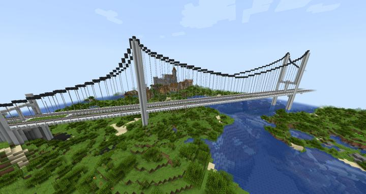
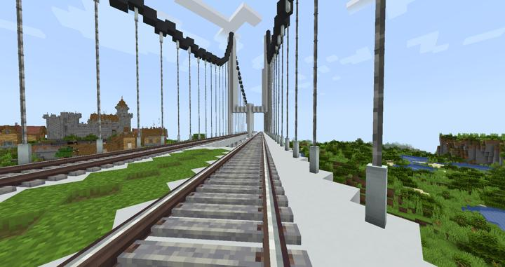

# 하모닉 브릿지

러쉬 스택과 스파크 타이드 역 사이를 잇는 거대한 현수교

서버에서 처음으로 진행된 대규모 합동 건축물이다. 
happyjourney가 곡선을 설계하고 그 외에 노가다는 jasuk500이 담당했다. 

원래는 아래에 아치형태로 만들려고 했으나, 대각선 방향으로 가는 다리라서 매우 힘들다는것을 깨닫고 현수교 형태로 바꿨다. 

이 건축물을 지어본 이후로 철도를 최대한 직각으로 짓기로 합의하였으며, 러쉬스택->스파크 타이드 부분의 철도 생김새가 크게 변하는 계기가 되었다.

:::details 사진들
다리 정면 샷

:::

### 상위 장소
<!-- tag_source_open:link_list:child_spot -->
- [오버월드 순환 철도](../buildings/overworld_circular_railway.md)
<!-- tag_close -->

<!-- ### 하위 장소 목록 -->
<!-- tag_target_open:reverse_link_list:child_spot -->
<!-- tag_arg:preset:spots_inside -->
<!-- tag_close -->

<!-- 보유 시설 목록 -->
<!-- tag_target_open:reverse_link_list:building_spot -->
<!-- tag_arg:preset:systems_inside -->
<!-- tag_close -->

### 참여자
<!-- tag_source_open:link_list:member_contribute -->
- [jasuk500](../members/jasuk500.md)  
노가다, 철선 설치
- [happyjourney](../members/happyjourney.md)  
레일 배치, 곡선 설계, 노가다 지시
<!-- tag_close-->