# 순환 철도 - 러쉬 스택

아름다운 바다와 높게 솟은 빛나는 돌기둥들.

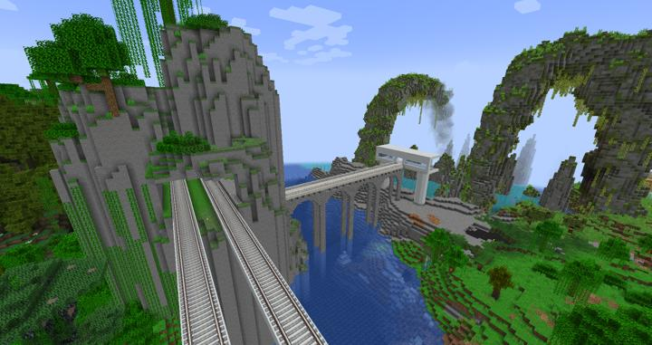

<!-- tag_target_open:frame:overworld_circular_rail -->
:::tip 오버월드 순환 철도 노선도
[오버월드 순환 철도](overworld_circular_railway.md)의 모든 역 목록

[길드](ocr_the_guild.md) -> [러쉬 스택](ocr_lush_stack.md) -> [스파크 타이드](ocr_spark_tide.md) -> [크라시움](ocr_cratium.md) -> ...
:::
<!-- tag_close -->

철도가 높게 솟은 돌기둥을 관통하며, 그 안에 정거장이 지어져 있다. 
엘리베이터를 통해 이동하며, 총 3개의 구획이 있다. 
- L층: 열차에 탑승할 수 있는 정거장이 있다. 
- F2층 : 돌기둥의 위로 올라가 전망대가 있다. 맨 위의 호수 밑바닥과 연결되어 있어서 수중 통로를 통과한다.
- B1층 : 러쉬스택 역사 내의 카페, 음식점이 위치해 있으며, 러쉬 스택 모노레일로 갈 수 있는 다리가 있다.

## 업데이트 내역

### 2023-05-11 정거장 연결
:::details 사진들

첫 철도 관통 직후  
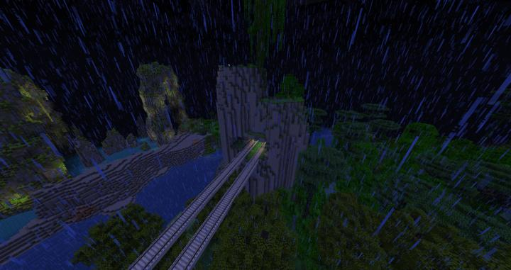
승강장 내부 공간  
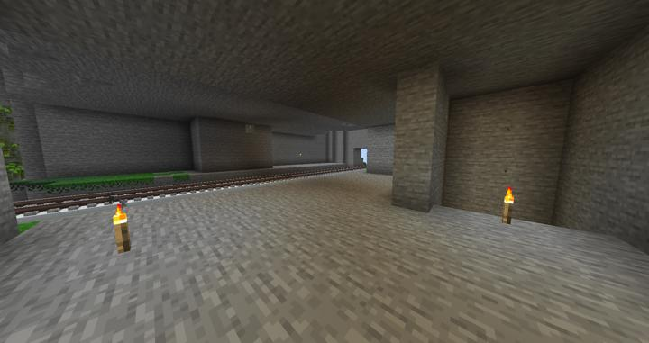
반대편 플랫폼으로 가는 지하 공간  
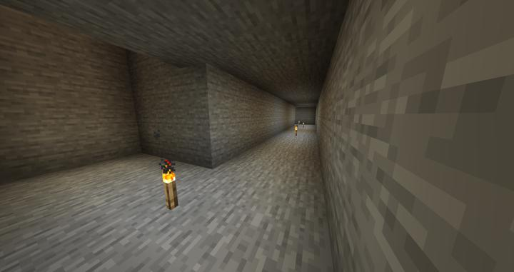
철도 오는 뷰  
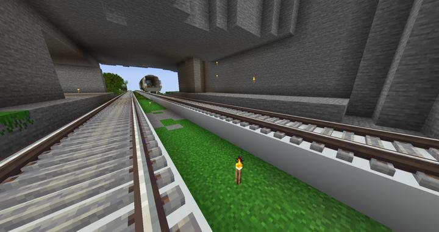
엘레베이터가 들어갈 공간  
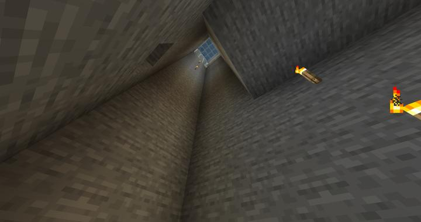
모노레일 타러 올라가려고 했던 공간  
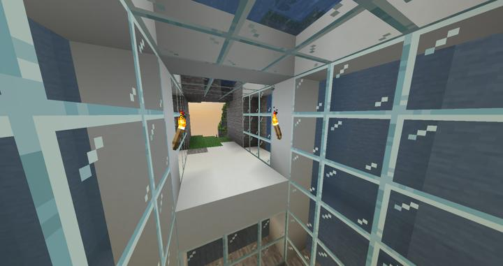
돌기둥 위에 있는 전망대  
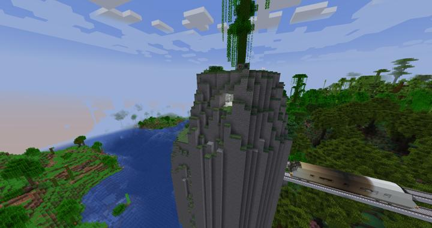
호수 아래에 보이는 엘레베이터  
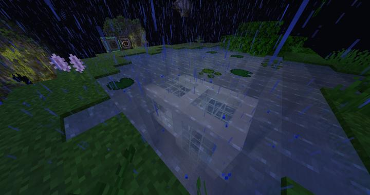
지하 1층 엘레베이터만 있는 상태  
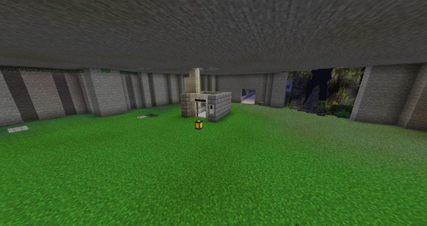
:::

### 2023-05-20 컬쳐 스페이스 & 러쉬스택 무인카페 오픈
[해당 문서 참조](lush_stack_cafe.md)

### 2023-05-24 정거장 & 전망대 공사

:::details 사진들
정거장. 기존에 반대편도 엘레베이터로 하려 했지만, 너무 불편하다는 의견이 있어서 에스컬레이터로 대체되었다.  
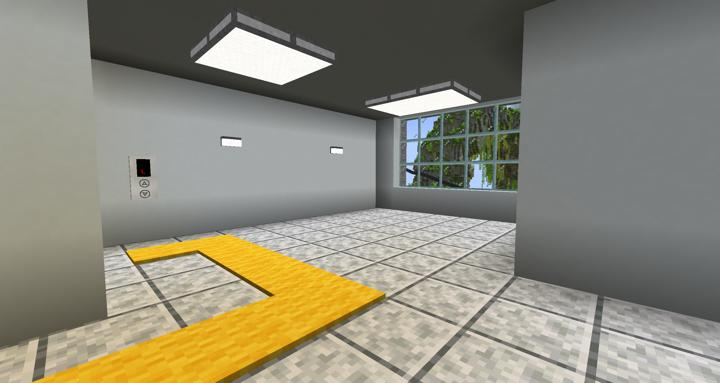

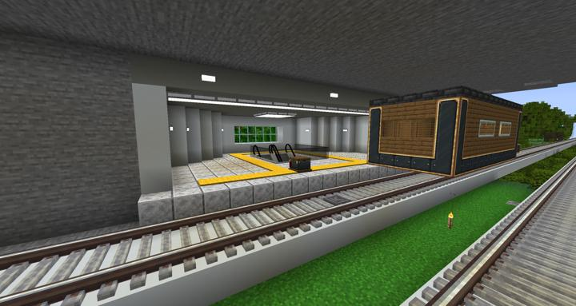

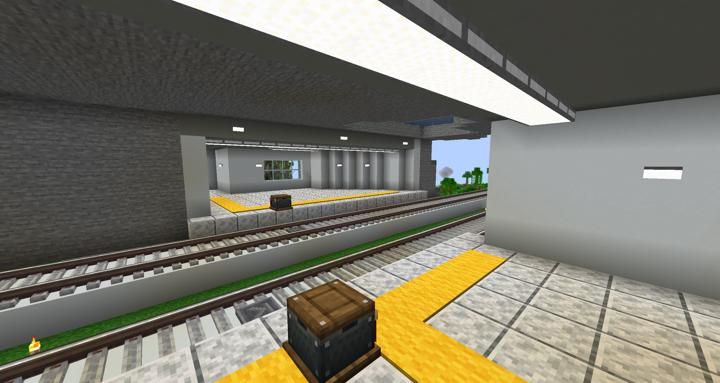

전망대. 최대한 간단하게 만들었다. macaw의 브릿지를 플랫폼처럼 사용했다.  
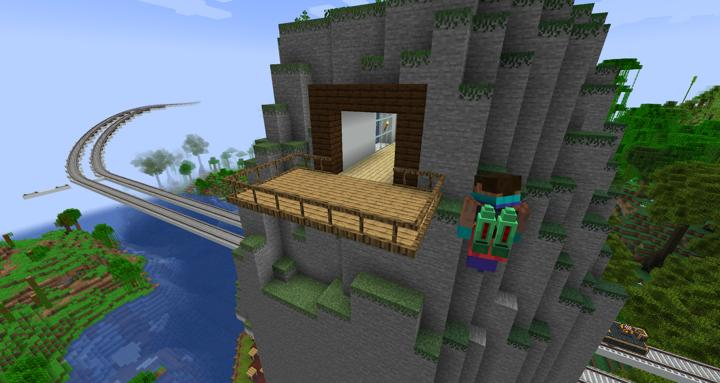
:::

## 타 문서와의 관계
<!-- ### 상위 장소 -->
<!-- tag_source_open:link_list:child_spot -->
<!-- tag_close -->

<!-- ### 하위 장소 목록 -->
<!-- tag_target_open:reverse_link_list:child_spot -->
<!-- tag_arg:preset:spots_inside -->
### 하위 장소 목록
|시설|세부 사항|
|---|---|
|[러쉬 스택 모노레일](lush_stack_monorail.md)|러쉬 스택 지역을 가까이서 볼 수 있는 모노레일|
|[러쉬 스택 무인 카페](lush_stack_cafe.md)|컬쳐 스페이스에 위치한 원버튼 로봇 자동 무인 카페|
<!-- tag_close -->

<!-- 보유 시설 목록 -->
<!-- tag_target_open:reverse_link_list:building_spot -->
<!-- tag_arg:preset:systems_inside -->
<!-- tag_close -->

### 참여자
<!-- tag_source_open:link_list:member_contribute -->
- [jasuk500](../members/jasuk500.md)  
역사 제작, 전망대 건축, 승강장 건축, 레일 배치
- [BANJUHARA](../members/BANJUHARA.md)  
역사 제작, 컬쳐 스페이스 건축
<!-- tag_close-->