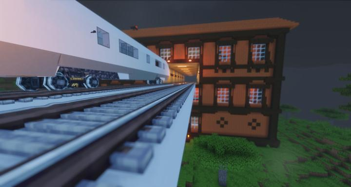
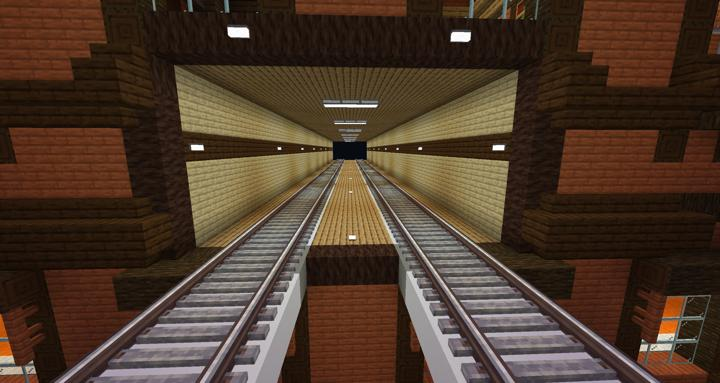
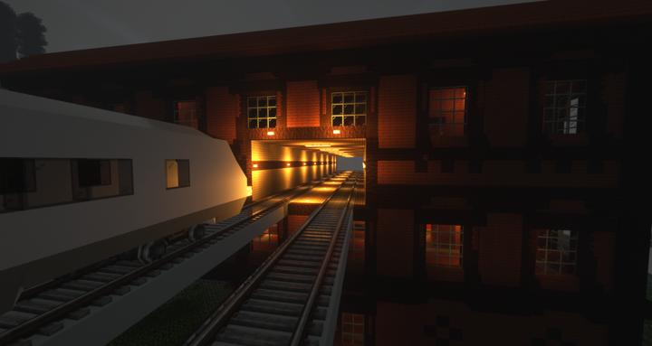

# 맨션 터널

감히 철도를 짓는데 방해되던 맨션을 자비없이 뚫어버린 터널. 

위치는 스파크 타이드 -> 크라시움 -> 맨션 터널에 있다.  

사실 일부러 맨션쪽으로 경로를 잡은다음 가운데를 의도적으로 뚫었다. 

원래는 단면을 적나라하게 다 보여주려고 했으나, 너무 이상해 보인다는 의견이 많아서 그냥 나무판자로 덧댄 터널처럼 바꿨다. 

기존 맨션에 있던 잡몹들이나 스포너를 일일히 찾아서 부수는 시간이 더 걸렸다. 

## 업데이트 내역

### 2023-06-24 맨션 터널 공사 

:::details 사진들
터널 정면의 모습  

밤에 쉐이더가 적용된 터널 입구  

:::

## 타 문서와의 관계
### 상위 장소
<!-- tag_source_open:link_list:child_spot -->
- [오버월드 순환 철도](overworld_circular_railway.md)
<!-- tag_close -->

<!-- ### 하위 장소 목록 -->
<!-- tag_target_open:reverse_link_list:child_spot -->
<!-- tag_arg:preset:spots_inside -->
<!-- tag_close -->

<!-- 보유 시설 목록 -->
<!-- tag_target_open:reverse_link_list:building_spot -->
<!-- tag_arg:preset:systems_inside -->
<!-- tag_close -->

### 참여자
<!-- tag_source_open:link_list:member_contribute -->
- [jasuk500](../members/jasuk500.md)  
터널 건축, 철도 잇기, 스포너 제거
- [BANJUHARA](../members/BANJUHARA.md)  
잡몹 쓸어버리기
<!-- tag_close-->