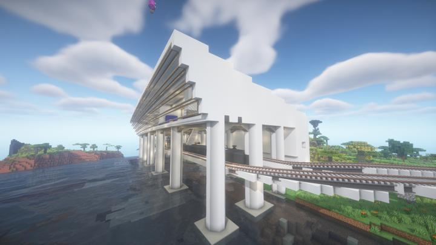
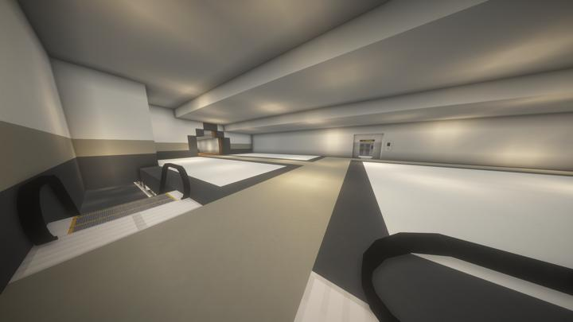
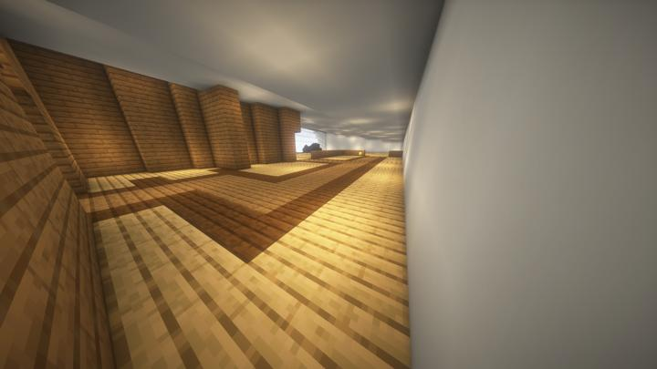

# 순환 철도 - 스파크 타이드

수상기와 화산을 동시에 볼 수 있는 플라자

<!-- tag_target_open:frame:overworld_circular_rail -->
:::tip 오버월드 순환 철도 노선도
[오버월드 순환 철도](overworld_circular_railway.md)의 모든 역 목록

[길드](ocr_the_guild.md) -> [러쉬 스택](ocr_lush_stack.md) -> [스파크 타이드](ocr_spark_tide.md) -> [크라시움](ocr_cratium.md) -> ...
:::
<!-- tag_close -->

앞바다에 바로 해안선 라인을 따라 대각선으로 들어오는 철도가 있다.  
역 내부에는 다양한 쇼핑 플라자 상점들이 자리잡고 있으며, 
앞바다에는 수상기 선착장이 있어서 언제든지 비행기를 타고 날라 바다위 더 큰 lush stacks 바이옴을 구경할 수 있다.

바로 옆으로 200블럭 정도 가면 활화산이 있으며, 자연적으로 스폰된 지형이다. 

여담으로 이 역의 이름을 정하는데 힘들어해서 chat gpt 4.0을 써서 80개의 후보군을 뽑고, 그 중 좋은 조합을 변형하여 정했다.

흰색콘크리트로 외관을 마무리하여 통일성을 줌
내부는 콘크리크와 나무를 각각사용하여 여러 컨셉의 방을 만듬
지하에서는 수상기를 탈수 있을 예정

## 타 문서와의 관계
<!-- ### 상위 장소 -->
<!-- tag_source_open:link_list:child_spot -->
<!-- tag_close -->

<!-- ### 하위 장소 목록 -->
<!-- tag_target_open:reverse_link_list:child_spot -->
<!-- tag_arg:preset:spots_inside -->
### 하위 장소 목록
|시설|세부 사항|
|---|---|
|[볼케이노 모노레일](volcano_monorail.md)|볼케이노 지역을 가까이서 볼 수 있는 모노레일|
<!-- tag_close -->

<!-- 보유 시설 목록 -->
<!-- tag_target_open:reverse_link_list:building_spot -->
<!-- tag_arg:preset:systems_inside -->
<!-- tag_close -->

### 참여자
<!-- tag_source_open:link_list:member_contribute -->
- [happyjourney](../members/happyjourney.md)  
역사 건축
- [jasuk500](../members/jasuk500.md)  
레일 배치
- [BANJUHARA](../members/BANJUHARA.md)  
레일 배치
<!-- tag_close-->