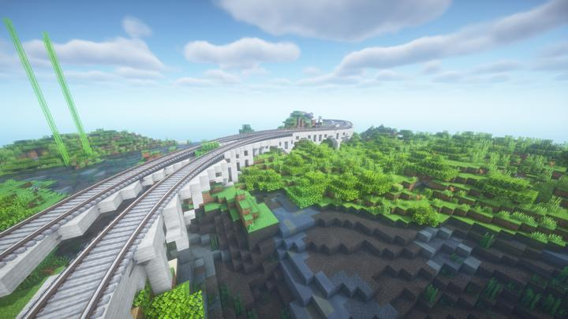
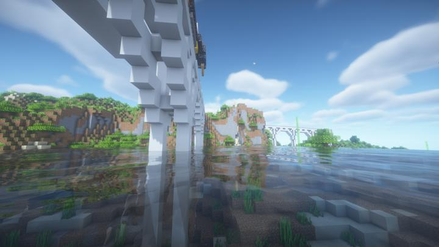
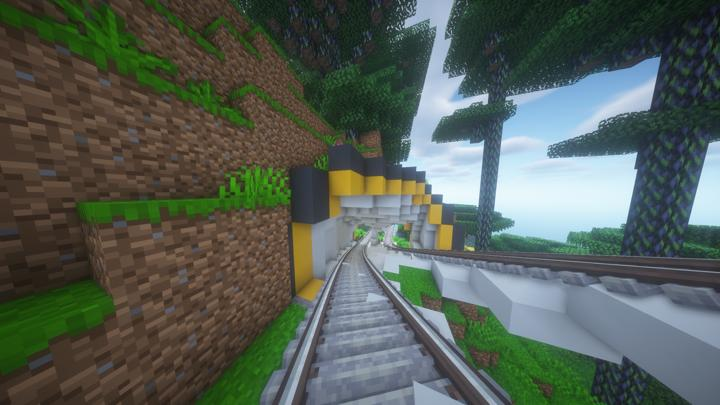

# 오버월드 순환 철도

오버월드의 각종 관광지를 순회하는 2개의 레일철도.

<!-- tag_target_open:frame:overworld_circular_rail -->
:::tip 오버월드 순환 철도 노선도
[오버월드 순환 철도](overworld_circular_railway.md)의 모든 역 목록

[길드](ocr_the_guild.md) -> [러쉬 스택](ocr_lush_stack.md) -> [스파크 타이드](ocr_spark_tide.md) -> [크라시움](ocr_cratium.md) -> ...
:::
<!-- tag_close -->

시계방향과 반시계 방향으로 도는 2개의 레일이 나란히 달리는 구조

하나의 철도 당 n대의 열차가 자동으로 달리고 있으며, 최소 배차 간격은 n분이다.

## 연결 건축물
### 라임웨이 브릿지
길드 역과 러쉬스택 역 사이의 작은 다리.  

### 퍼펜디큘러 브릿지
길드 역과 러쉬스택 역 사이의 직각 다리.  

### 구이나 터널
스파크 타이드 역과 크라시움 역 사이에 작은 터널.

## 타 문서와의 관계
### 상위 장소
<!-- tag_source_open:link_list:child_spot -->
- 오버월드
<!-- tag_close -->

<!-- ### 하위 장소 목록 -->
<!-- tag_target_open:reverse_link_list:child_spot -->
<!-- tag_arg:preset:spots_inside -->
### 하위 장소 목록
|시설|세부 사항|
|---|---|
|[아스펜 정거장](ocr_aspen_station.md)|스파크 타이드와 크라시움 역 사이의 작은 정거장|
|[하모닉 브릿지](ocr_harmonic_bridge.md)|러쉬 스택과 스파크 타이드 역 사이를 잇는 거대한 현수교|
<!-- tag_close -->

<!-- 보유 시설 목록 -->
<!-- tag_target_open:reverse_link_list:building_spot -->
<!-- tag_arg:preset:systems_inside -->
### 보유 시설 목록
|시설|세부 사항|
|---|---|
|[Create 기차들](../systems/create_trains.md)|레일 위에서 상시 대기중|
<!-- tag_close -->

### 참여자
<!-- tag_source_open:link_list:member_contribute -->
- [jasuk500](../members/jasuk500.md)  
역 데코, 경로 계획
- [BANJUHARA](../members/BANJUHARA.md)  
철도 배치, 경로 계획
- [happyjourney](../members/happyjourney.md)  
열차 제작, 레일 제작, 레일 데코, 경로 계획
<!-- tag_close-->