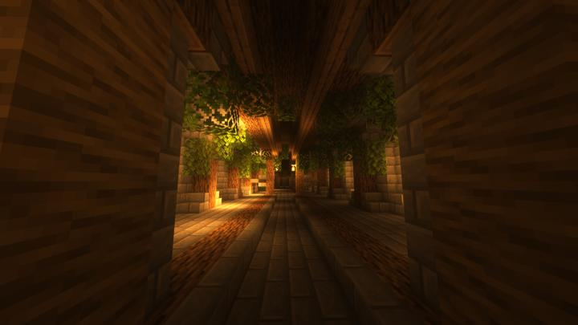

# 식물의 방

보타니아를 다루는 방.

반쯤 버려짐, 내부에 마나를 모으는 꽃이 다수 심어짐 굉장히 낮은 효율 식물관련 마법 모드를 다루는 방으로 입사귀와 나무원목을 써 모드의 특징을 드러냄 

## 타 문서와의 관계
### 상위 장소
<!-- tag_source_open:link_list:child_spot -->
- 길드 지하 2층
<!-- tag_close -->

<!-- ### 하위 장소 목록 -->
<!-- tag_target_open:reverse_link_list:child_spot -->
<!-- tag_arg:preset:spots_inside -->
<!-- tag_close -->

<!-- ### 보유 시설 목록 -->
<!-- <!-- tag_target_open:reverse_link_list:building_spot -->
<!-- tag_arg:preset:systems_inside -->
<!-- tag_close -->

### 참여자
<!-- tag_source_open:link_list:member_contribute -->
- [happyjourney](../members/happyjourney.md)  
건축
<!-- tag_close-->