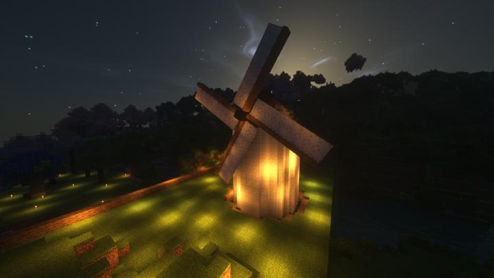

# 바람이 머무는 식당

풍차에서 생기는 동력으로 요리를 하는 식당.

풍차의 전반적인 형상은 그리스식 풍차를 많이 참고했다.

### 상위 장소
<!-- tag_source_open:link_list:child_spot -->
- 길드 주변
<!-- tag_close -->

<!-- ### 하위 장소 목록 -->
<!-- tag_target_open:reverse_link_list:child_spot -->
<!-- tag_arg:preset:spots_inside -->
<!-- tag_close -->

<!-- ### 보유 시설 목록 -->
<!-- tag_target_open:reverse_link_list:building_spot -->
<!-- tag_arg:preset:systems_inside -->
### 보유 시설 목록
|시설|세부 사항|
|---|---|
|[쿠킹 벙커](../systems/cooking_bunker.md)|모든 파머스 딜라이트 요리를 목표로 하는 쿠킹 벙커|
<!-- tag_close -->

### 참여자
<!-- tag_source_open:link_list:member_contribute -->
- [happyjourney](../members/happyjourney.md)  
건축
<!-- tag_close-->