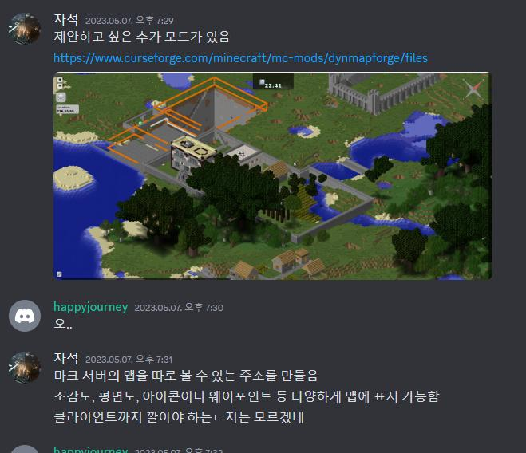
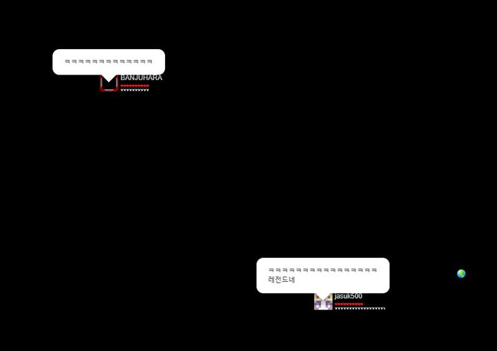
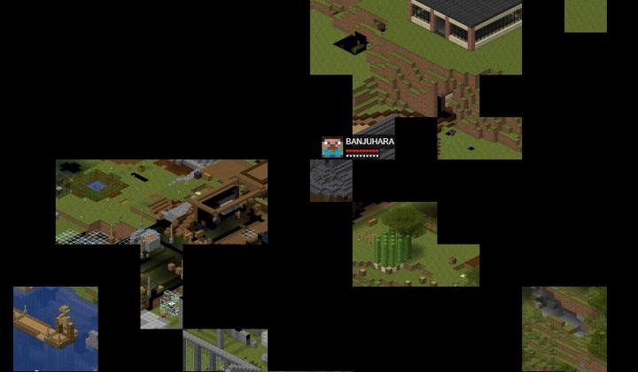
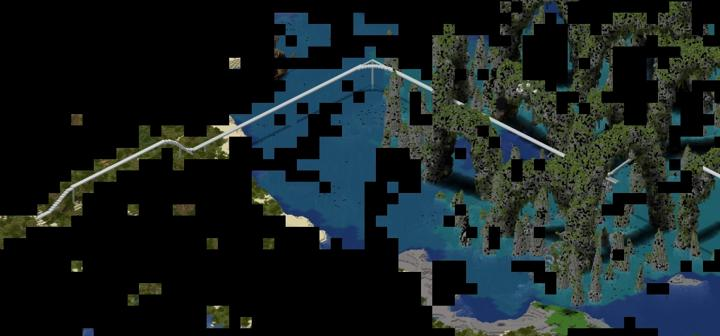
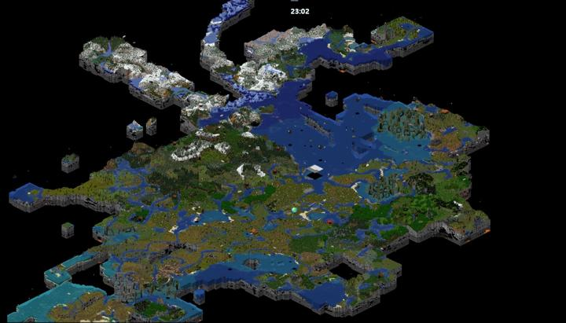
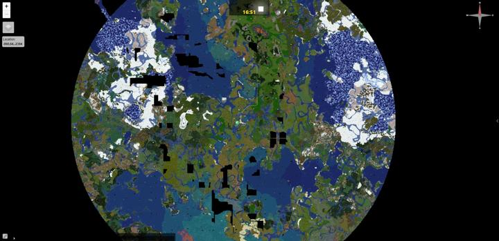
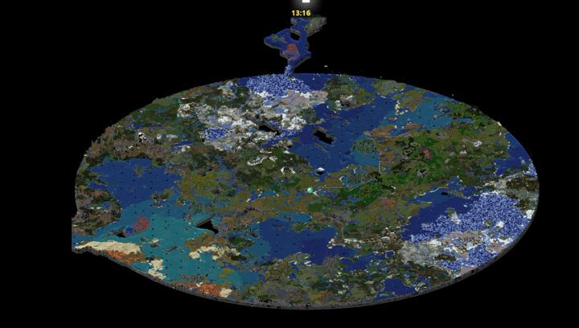
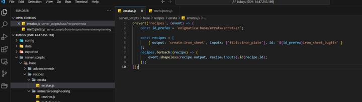
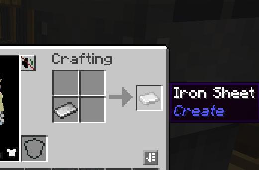
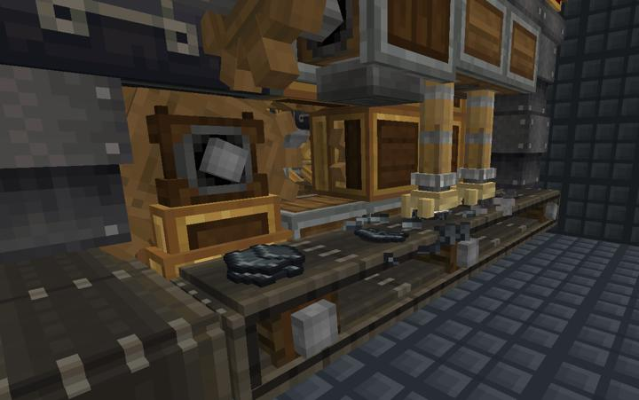

# 연혁

### 2023-04-15 첫 시작

### 2023-04-21 1차 모드 추가  

- create_central_kitchen
- create_crystal_clear
- create_enchantment_industry
- create_misc_and_things
- create_addition
- create_gear_addons
- create_steam_rails
- easy_villiagers

### 2023-04-23 서버 다이어리 사이트 탄생

서버 다이어리 사이트가 탄생했다.  
jasuk500이 관리하며, vuepress & github page로 제작했다.

### 2023-04-24 서버 롤백 사태  

갑자기 서버가 불안정해지더니, stop, spark tps를 쳐도 응답이 없어짐  
cpu 사용량이 600%(6코어 cpu이므로 사실상 전부)까지 올라감  
강제 종료 후 재부팅 했으나, 오버월드를 제외한 나머지 지역은 시간이 하루 전으로 돌아가있음.  
오버월드도 일부 부분의 컨피그나 세부 블럭 내용이 달라지거나 삭제되어 있었음.  
backup 주기를 2시간으로 늘리고, 백업 실패 메세지가 나올 시 반드시 관리자에게 알리도록 조치.  

### 2023-04-27 1차 다이어리 기록 제보

BANJUHARA, kidoxt 등이 `내가 한 일` 란에 내용과 이미지를 올렸다.  
github page는 한달 트래픽 한도가 100GB이므로 너무 많은 이미지는 좋지 않다.  
이미지의 용량이 너무 커짐에 따라, 무손실 압축인 .png-> 손실 압축 .jpg으로 바꿨으며
허용되는 이미지의 가로 최대 사이즈는 720px로 수정하였다. 
파이썬 스크립트로 해결하였다.

### 2023-04-28 길드 지하 몬스터 점령 사건

지하의 라이팅 시스템을 갈아엎겠다고 지하의 모든 광원을 제거한 탓에 몬스터가 대량으로 스폰된 사건.  
최근에 제작중인 시설들은 전부 집 지하에 있었는데, 텔레포터를 타고 들어온 사람들이 몬스터를 피해 도망다니며 혼비백산하는 사건이 벌어졌다. 
피해자중 한 명은 Flare Lantern을 숨겨서 설치해버리면 라이팅 시스템을 갈아엎지 못할것이라는 과격한 의견까지 제시하였다.  
Mega Torch를 사용하여 집을 포함한 주변의 모든 몬스터를 없앰으로써 사태는 일단락 되었다.  
### 2023-04-29 2차 모드 추가

- Stabx Modern Guns
- Modern Escalators & Elevators
- Framework
- CGM
- ExtraStorage

### 2023-04-29 원자로 방사능 유출 사태

마이닝 디멘션에서 만들던 메카니즘 모드의 핵 분열로에서 방사능 유출 사고가 발생했다.  
가이거 계수기의 값이 정상 범주를 아득히 넘는 56시버트가 찍혔으며, 방호복 없이 마이닝 디멘션에 이동할 경우 심각한 손상을 받을 수 있다.  
최초 발견자는 BANJUHARA로 원자로 시설의 총책임자이다. 원자로 방사능 유출에 대한 책임을 통감중에 있으며, 유출된 방사능을 청소할 수 있는 방법은 없음을 알렸다. 현재로써는 방사선이 자연 감소하기를 바랄 수 밖에 없고, 반드시 가야한다면 꼭 방호복을 착용할 것을 거듭 강조한것으로 알려졌다.  
(2024-05-01 현재는 방사선이 자연 감소하여 방호복 없이 입장 가능하다.)

### 2023-04-29 서버 이전 및 퍼포먼스 대폭 향상

기존의 SKH 시스템에서 클라우드 서버를 통해 서비스되던 서버가 지나치게 성능이 부족하여, jasuk500 의 개인 노트북으로 서버를 이전하였다.  
현재는 SSD 파티션을 80기가 할당하여 Ubuntu 22.04 위에서 호스팅 중이다.  
물리적인 컴퓨터에 SSD, i7 8650H로의 CPU 변화로 인해 대부분의 퍼포먼스가 크게 향상되었으며,
특히 평균 Tick Duration이 4인 기준 80->23으로 감소하였다. 

### 2023-04-30 가축 얼티마인 사건

집에서 처음부터 기르던 동물 울타리를 BANJUHARA가 얼티마인으로 싹 캐버리는 바람에, 상당수의 동물들이 탈주한 사건이다. 
이미 동물 재료들을 많이 얻은 상태여서 비난없이 넘어갔다.

### 2023-05-05 서버 접속 불능 사태

서버 컴퓨터의 주인인 jasuk500이 하루정도 집을 비운 사이, 외출한지 3시간만에 집의 인터넷이 고장나 어린이날 내내 서버 접속이 불가능했던 사태.  
정작 다음날 집에 돌아와서 확인해보니 인터넷은 스스로 고쳐진 상태였다. 결국 뭐가 어떻게 됐는진 모른다.

### 2023-05-07 Dynmap 도입

서버의 맵 상태를 실시간으로 웹상에 보여주는 Dynmap 모드를 도입했다.  
이제 특정 주소에서 서버에 있는 모든 사람과 채팅, 맵의 변화를 실시간으로 확인할 수 있다.  
[주소](http://14.47.253.169:8123)

:::details 당시 사진





:::

### 2023-05-11 2차 청크 프리로딩

오버월드 순환 철도의 다음 역까지의 지형을 탐사하는데 있어서 청크 생성 속도가 지나치게 느려 조사에 어려움이 있었다.  
이에 집 좌표 주변으로 312청크(4998블럭) 반경을 청크 프리로딩을 통해 맵을 생성하도록 조치했다.  
월드맵의 용량이 2.2기가->6기가로 늘었다. 
프리청크 로딩에 6시간, 다인맵 렌더링에는 총 15시간이 걸렸다.

:::details 넓어진 월드맵  


:::

### 2023-05-15 불가능한 조합법 : 모노레일 사태

monorail track의 조합법에 요구되는 iron sheet가, Almost Unified(비슷한 종류의 자원을 하나로 묶어 레시피를 자동으로 수정해주는 모드팩용 모드)  때문에 아예 아이템 자체가 삭제되어 있어, 조합이 불가능한 문제가 발생.
JEI를 비롯한 어디에서도 iron sheet가 없어서 아예 없는 아이템 취급이었다.

이에 대한 조치로, 모드팩의 서버쪽 소스 코드를 수정하여 iron plate -> iron sheet로 바꾸는 shapeless 조합법을 서버에 추가하였다.
JEI에서 iron sheet가 검색되진 않지만, 조합은 가능하며, monorail track 역시 만들 수 있게 되었다.

 :::details 당시 사진들
 
수정된 서버쪽 js 코드  
 

수정된 코드  
 ```javascript
// server_files\enig8\kubejs\server_scripts\base\recipes\errata\erratas.js
onEvent('recipes', (event) => {
    const id_prefex = 'enigmatica:base/errata/erratas/';

    const recipes = [
        { output: 'create:iron_sheet', inputs: ['ftbic:iron_plate'], id: `${id_prefex}iron_sheet_bugfix` }
    ];
    recipes.forEach((recipe) => {
        event.shapeless(recipe.output, recipe.inputs).id(recipe.id);
    });
});
 ```

 추가된 조합법 사진  
 

모노레일 트랙이 만들어지는 모습  


 :::