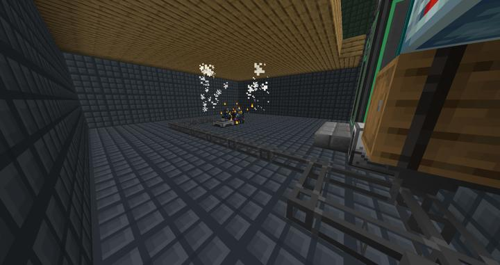
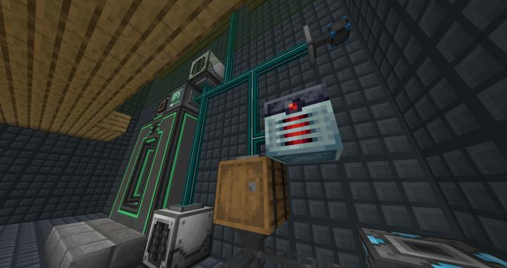
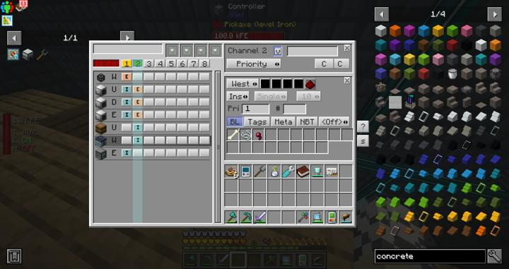

# 자동 몹 농장

RS 내부의 몹 드랍템 수량을 체크하며 자동으로 스폰하고 잡아주는 무인 농장.

굉장히 다양한 모드의 조합으로 만들어졌다.

- Apothoesis 모드에서 추가하는 스포너  
- Industial Foregoing 모드의 mob crusher 
- Flux Network 모드로 전력 무선 전송   
- Xnet 모드로 아이템 파이핑 간소화 
- Thermal Expansion의 Nullifier로 쓸데없는 방어구 삭제
- Refined Storage의 import와 Detector를 사용하여 보관 및 재고 제어
- Compact Machine 차원에서 렉을 최소화
- Mekanism 모드의 텔레포터를 통해 오갈 수 있도록 조치

:::warning
몹 크러셔에서 쓸모없는 갑옷 부산물이 나오는데, 현재 nullifier에 필요한 것만 블랙리스트를 줘서 다 없애고 있다. 
추후에 새로운 몹을 추가할 땐, 해당 부산물을 필터에 추가해 주기 바란다.
:::

## 타 문서와의 관계
### 위치
<!-- tag_source_open:link_list:building_spot -->
- [컴팩트 머신 차원](../buildings/compact_machine_dimension.md)  
텔레포터 허브를 통해 이동할 수 있다.
<!-- tag_close -->

### 참여자
<!-- tag_source_open:link_list:member_contribute -->
- [jasuk500](../members/jasuk500.md)  
시스템 설계 및 제작
- [happyjourney](../members/happyjourney.md)  
시스템 설계 보조 및 제작
<!-- tag_close-->