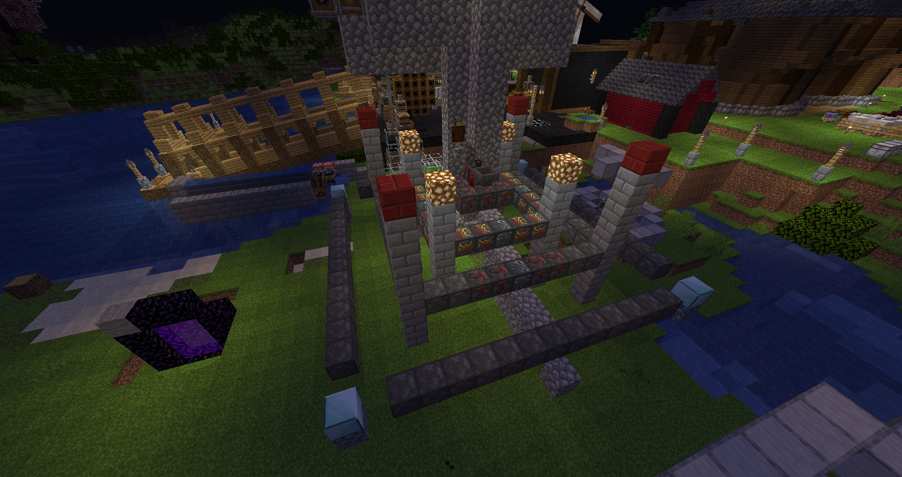
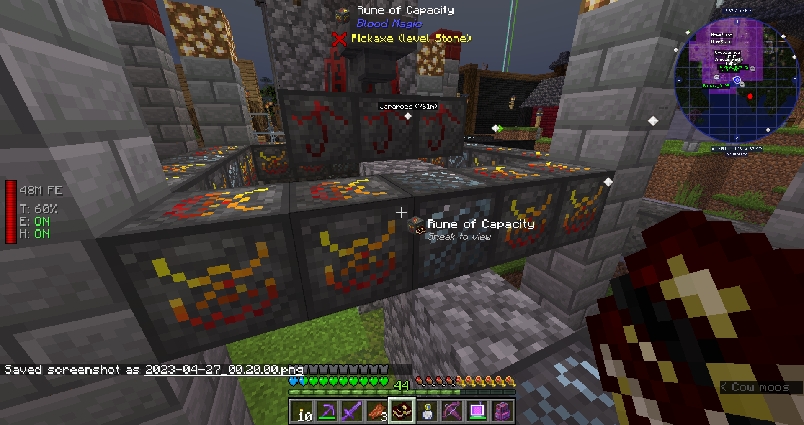
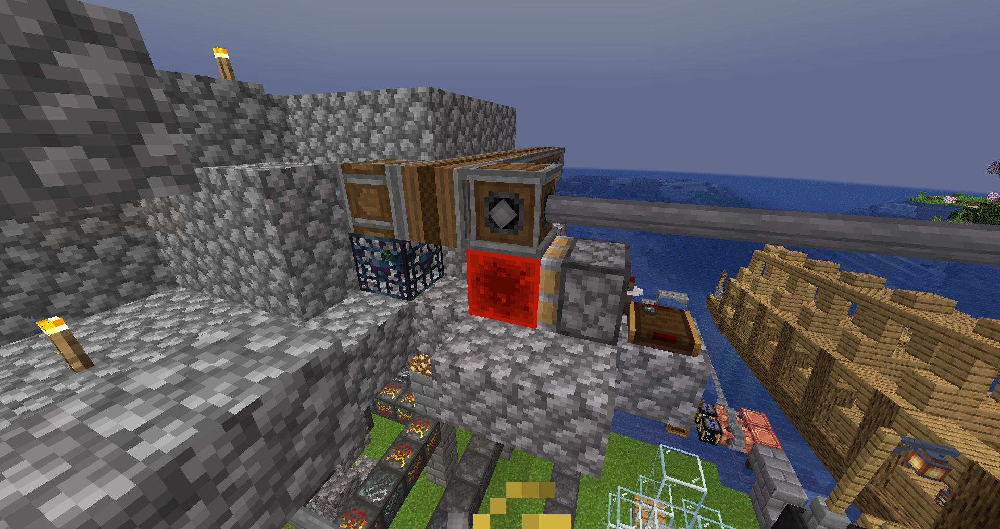
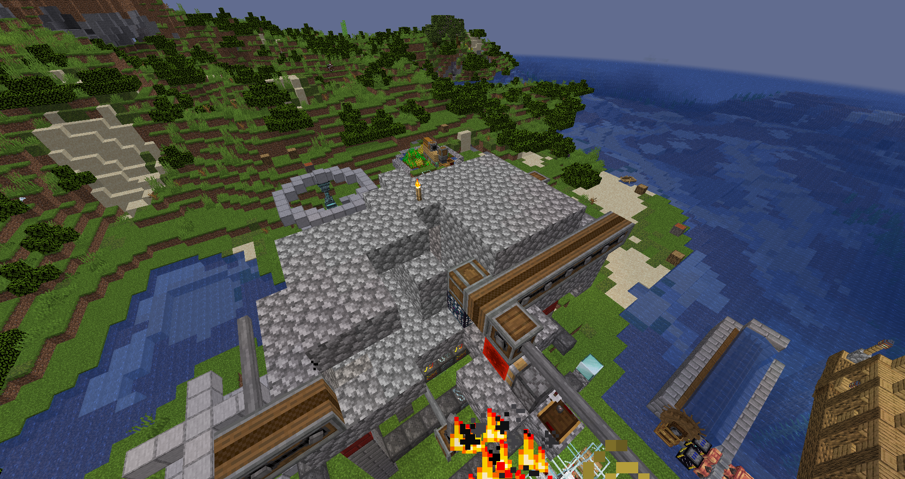

# Blood magic Blood Altar

지금은 5티어인데 티어가 높아질 수록 피라미드 같이 만들어야하다 보니 높이 잘못 잡으면 고생한다
위에는 몬스터 팜으로 라이프 포인트를 모으기 위해서는 몹을 Altar 반경 2블럭 내에서 Dagger of sacrifice로 때려야한다

문양이 있는 블럭은 각자 효과가 부여되어 있음 꾸밀러면 이걸로 가능할듯하지만 재료가 만들기 귀찮다

Blood Altar에 몹을 공급하기 위한 몬스터 팜
처음에 그냥 설치했다가 좀비가 너무 많이 소환되어서 렉이 걸려서 레드스톤 신호로 생성되게 수정하고 몹 스폰도 적게 되게 공간을 한정시켜서 이리지러 바뀌게됨

  
