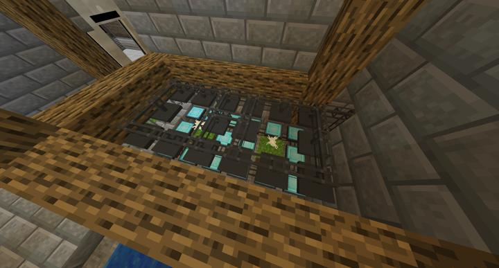
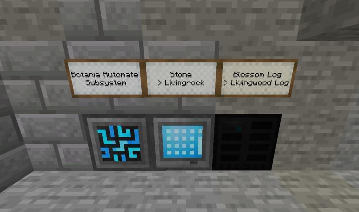

# 보타니아 자동화 서브시스템

보타니아 자동화 관련 설비들

Pure Daisy 옆에 돌이나 나무를 두면 일정 시간 후에 Livingrock, Livingwood로 변하는데 그걸 컨스트럭터와 디스트럭터로 빨아먹고 다시 돌과 나무를 설치하는걸 반복하는 장치

물론 텔레포터로 접근 가능 

## 업데이트 내역
### 2023-06-04 첫 완공

첫 건축
:::details 사진들
  
:::

## 타 문서와의 관계

### 위치
<!-- tag_source_open:link_list:building_spot -->
- 길드 지하 2층
<!-- tag_close -->

### 참여자

<!-- tag_source_open:link_list:member_contribute -->
- [BANJUHARA](../members/BANJUHARA.md)  
설계 및 제작
<!-- tag_close-->