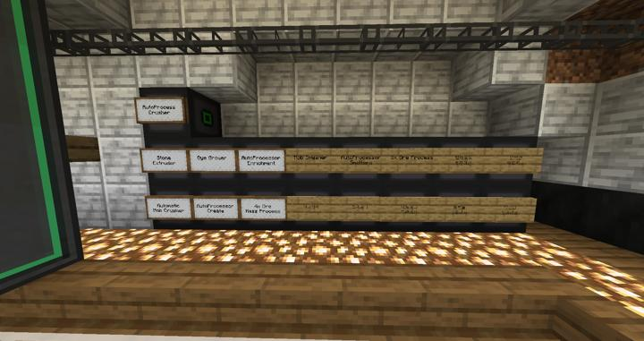
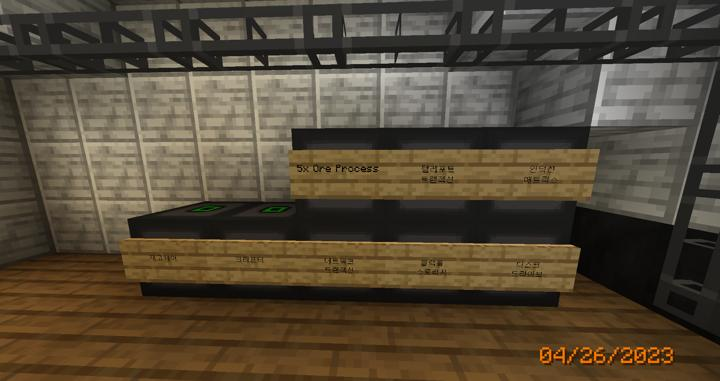

# 컴팩트 머신 메인

모든 컴팩트 머신 본체 보관소

컴팩트 머신 본체를 잃어버리지 않게 잘 보관하는 장소이다.

현재 따로 할당된 구역은 없으며, 일단 편의성을 위해 RS main 옆에 보관되어 있다.

만약 잃어버릴 경우를 대비해서 [텔레포터 트렌잭션](teleporter_hub.md)으로 각 방을 이어놓은 상태다.

### 2023-05-06 늘어난 방들

이전

이후
방이 거의 2배가 되어가고 있다

### 위치
<!-- tag_source_open:link_list:building_spot -->
- [연구소 - 메카](../buildings/lab_meka_lab.md)
RS 시설 바로 옆에 위치하고 있다.
<!-- tag_close -->

### 참여자
<!-- tag_source_open:link_list:member_contribute -->
- [jasuk500](../members/jasuk500.md)  
설계 및 제작
<!-- tag_close-->