# 크리에이트 자동 공정 룸

크리에이트 관련 시설 중 RS에 병합된 다양한 시설군이다.

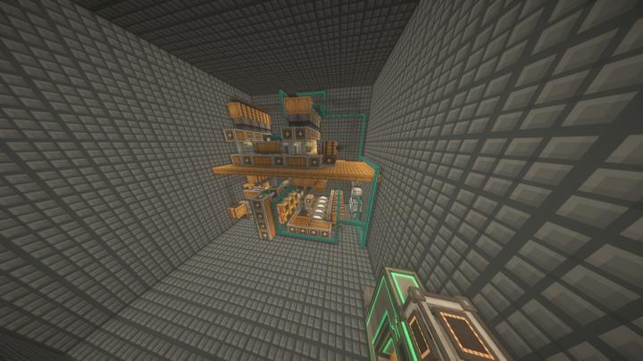

좁은 방 안에 많은 시설들이 들어가 있으며, 컴팩트 머신 차원에 있다. 

방이 좁아서 2개의 방이 할당되어 사용중이다. 

## 포함된 시설들

총 2개의 컴팩트 머신 maximum 방에 포함된 시설들은 다음과 같다. 

:::details 시설 목록
### 자동 황동 공정
Create의 믹서를 활용해 황동을 자동으로 생산하는 기계이다.
합금을 녹이기위한 열은 수백만개 있는 벗꽃나무를 태워서 얻는다.  
담당자 : [happyjourney](../members/happyjourney.md)  

### Create 케이싱 자동화 공장
총 4종류의 모든 케이싱을 자동으로 만들어내는 공장이다.
Xnet을 활용하여 최대한 단순한 구조로 증축이 쉽도록 만들었다.  
담당자 : [happyjourney](../members/happyjourney.md)  
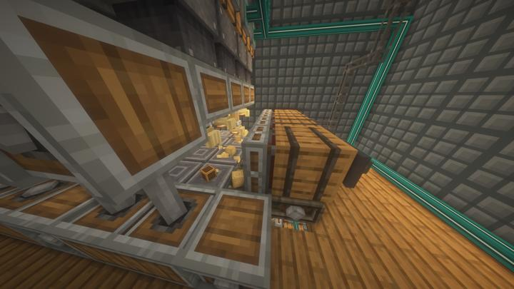

### Create 깨끗한 유리 케이싱 자동화 공장
총 4종류의 모든  깨끗한 유리 케이싱을 자동으로 만들어내는 공장이다.
Xnet을 활용하여 최대한 단순한 구조로 증축이 쉽도록 만들었다.  
담당자 : [happyjourney](../members/happyjourney.md)  
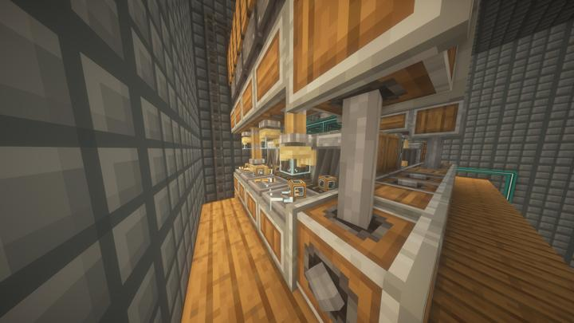

### Botania 꽃 공장
염료를 자동으로 양산하기위해 만들어진 공장
보타니아의 특수 뼛가루가 모든 색의 꽃을 만드는 점을 활용한 공장
뼛가루와 염료일부를 사용해 특수 꽃가루를 만들어 보타니아 꽃을 재배- 보타니아 꽃을 꽃입으로 변환 - 꽃입을 염료로 변환한다. 
수량제어로 모든종류의 꽃이 10000개가 넘도록 유지한다.  
담당자 : [happyjourney](../members/happyjourney.md)  
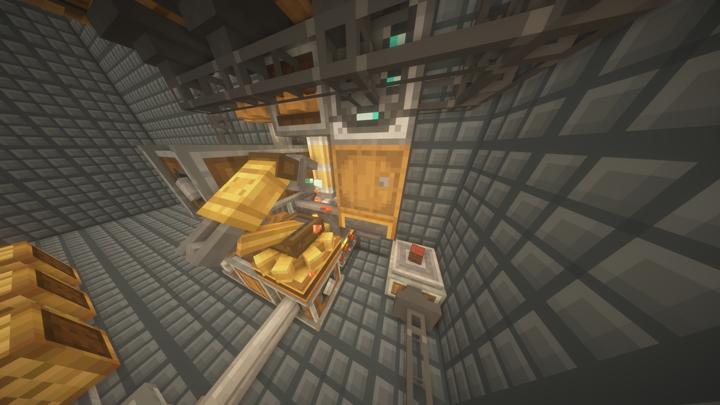

### Create 유리 케이싱 자동화 공장
총 4종류의 모든 유리 케이싱을 자동으로 만들어내는 공장이다.
Xnet을 활용하여 최대한 단순한 구조로 증축이 쉽도록 만들었다.  
담당자 : [happyjourney](../members/happyjourney.md)  
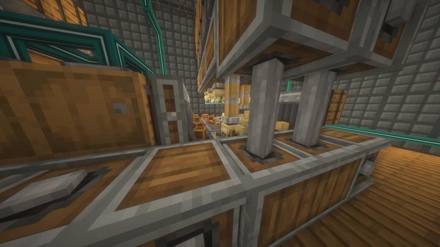

### 모노레일 제작 공정
물량이 상대적으로 적게 필요해서 병렬화는 하지 않았다. 이 시스템을 만드는 과정에서 모드팩을 하다보면 한번씩 있는 참 곤란한 문제를 겪었는데,, [불가능한 레시피 사태](../history/history.md#imposible_recipe)  
담당자 : [BANJUHARA](../members/BANJUHARA.md)    
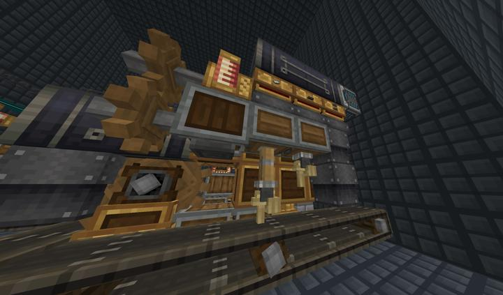

### 전기 모터 자동화
메카니컬 크래프터를 이용해야만 만들 수 있는데, 슬롯마다 템 종류 지정이 어려워서 기계 팔을 재료 가짓수만큼 쓸 수밖에 없었다.
좀더 세련된 방법을 쓰려면 각 슬롯에 메카니즘의 파이프를 연결하면 되는데 엄... 노간지  
담당자 : [BANJUHARA](../members/BANJUHARA.md)    
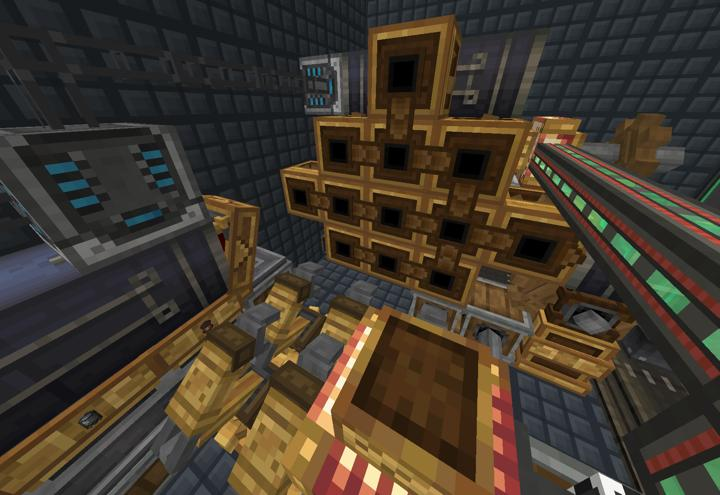

### Create Power Motor
AutoProcessor Create Room 2의 모든동력을 생산한다.
6+6의 모터가 양면에 설치되어 총 96,256su의 동력을 생산한다.
각각의 모터의 에너지 입력은 Xnet으로 제어된다.  
담당자 : [happyjourney](../members/happyjourney.md)  
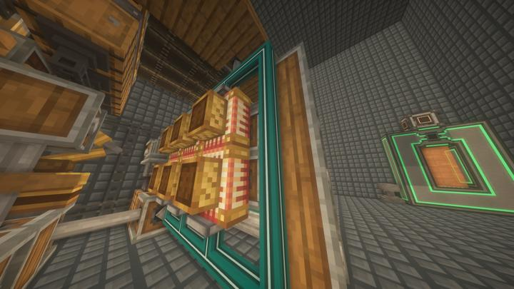

### 프레스 자동화
다양한 금속 판들을 병렬로 가공한다.  
담당자 : [BANJUHARA](../members/BANJUHARA.md)    
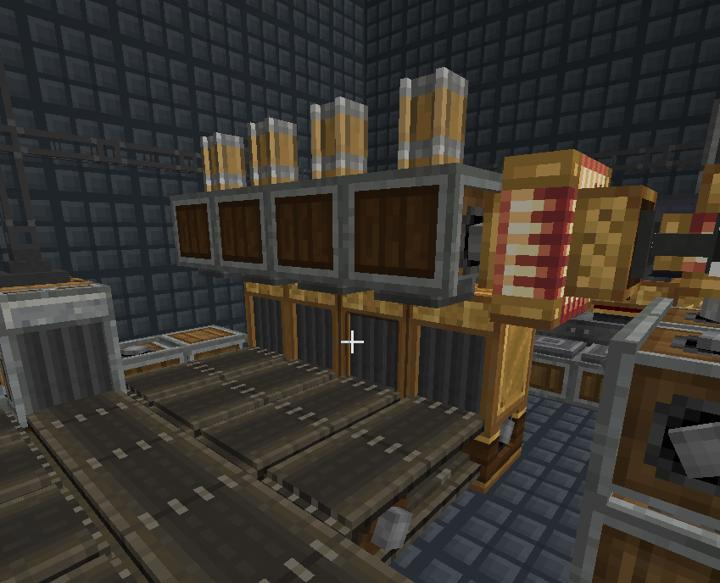

### create 철도 자동화 공장
레인의 병렬 자동화로 높은 효율을 이끌어냈지만 그만큼 부하가 심해 모터가 4개나 쓰였다.
AutoProcessor Create Room 1에 존재한다  
담당자 : [happyjourney](../members/happyjourney.md)  
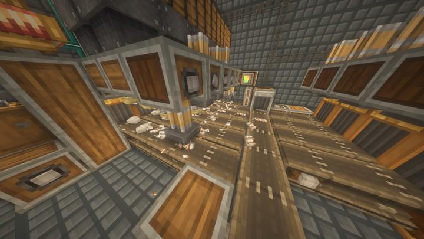

### Create Rolling Mill 자동화 공장
Create의 Rolling Mill이 만들 수 이있는 종류의 와이어와 봉을 크래프터를 활용해 자동조합이 가능하게 만들었다  
담당자 : [happyjourney](../members/happyjourney.md)  
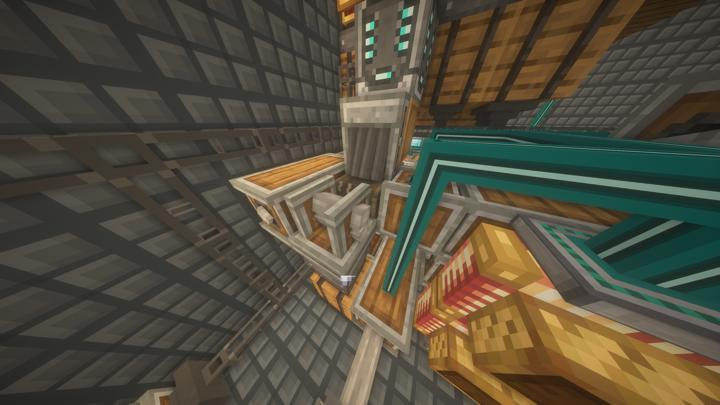

### Stripped Oak 특화 공장
위의 Create 케이싱을 만들기 위한 껍질 벗긴 참나무를 양산하는 장치이다.
4레인의 병렬화로 상당히 빠른 처리속도를 자랑한다.  
담당자 : [happyjourney](../members/happyjourney.md)  
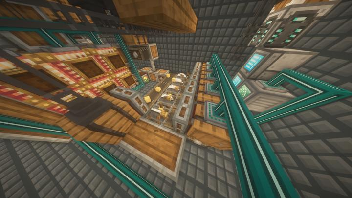

:::

### 위치
<!-- tag_source_open:link_list:building_spot -->
- [컴팩트 머신 차원](../buildings/compact_machine_dimension.md)  
텔레포터 허브를 통해 이동할 수 있다.
<!-- tag_close -->

### 참여자
<!-- tag_source_open:link_list:member_contribute -->
- [happyjourney](../members/happyjourney.md)  
자동화 시설 다수 설계 및 제작
- [BANJUHARA](../members/BANJUHARA.md)  
자동화 시설 다수 설계 및 제작
<!-- tag_close-->