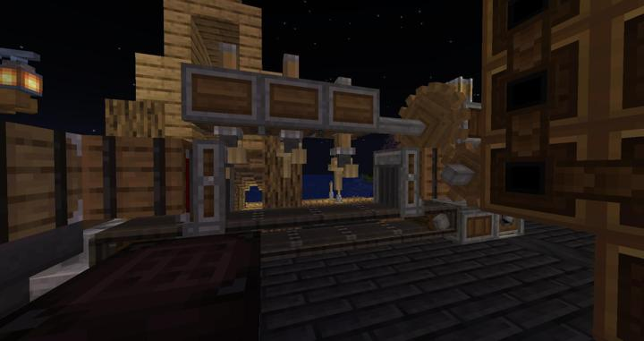

# Create 반자동 정밀기계 생성기

작은 톱니바퀴/큰 톱니바퀴/철조각을 넣으면 됨
동력 방향이 몇번이나 바뀌면서 벨트 순서를 확인하여 부품을 넣어야함.

벨트 방향에 따라서 동작이 달라지니 주의.

### 참여자
<!-- tag_source_open:link_list:member_contribute -->
- [kidoxt](../members/kidoxt.md)  
기계 배치 설계 및 제작
- [happyjourney](../members/happyjourney.md)  
주변 공간 데코
<!-- tag_close-->