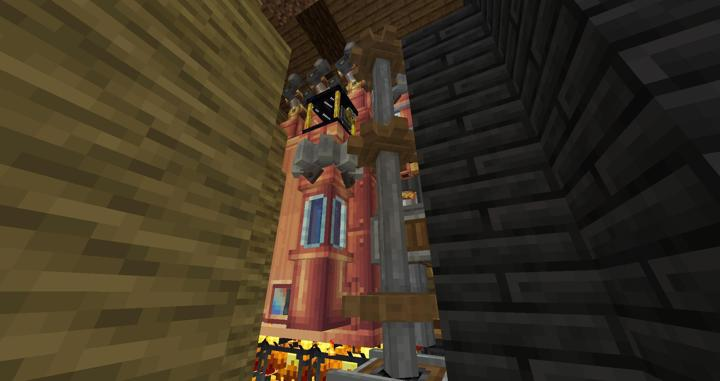
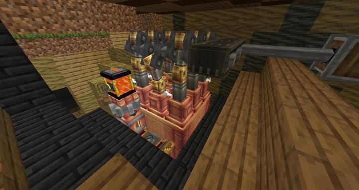
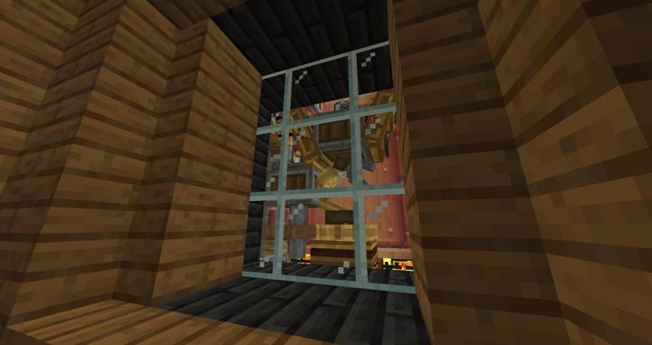
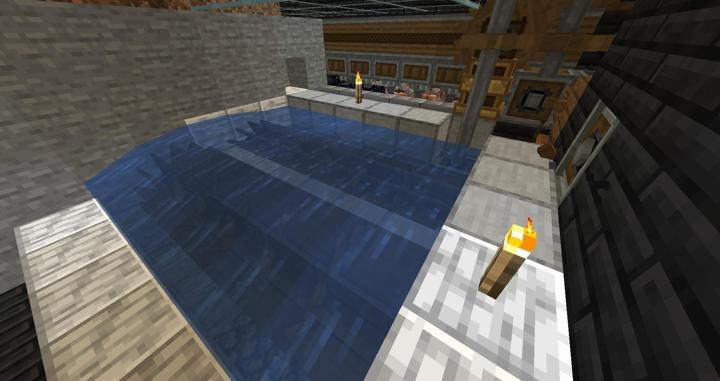

# Create 증기기관

처음부터 욕심내서 9티어 만들겠다고 하다가 용암 및 물 공급이 힘들어서 Ender tank를 이용하게됨
Ender tank의 버그로 꺼지고 물 공급이 막혀서 다시 꺼지는 악순환을 반복하다가 결국 외부 동력을 이용하여 해결함

증기기관용 외부 기관 그냥 물레바퀴임

## 타 문서와의 관계
### 위치
<!-- tag_source_open:link_list:building_spot -->
- 길드 지하 2층
<!-- tag_close -->

### 참여자
<!-- tag_source_open:link_list:member_contribute -->
- [kidoxt](../members/kidoxt.md)  
기계 배치 설계 및 제작
<!-- tag_close-->