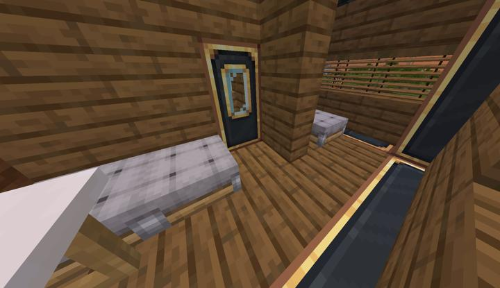

# Create 기차들

크리에이트를 사용해 만든 모든 기차들

## 기차 목록
### 에니횡단열차 1호
:::details 사진들
기차 전경  

기차 내부  

:::
### 기차 1

## 타 문서와의 관계
### 위치
<!-- tag_source_open:link_list:building_spot -->
- [오버월드 순환 철도](../buildings/overworld_circular_railway.md)  
레일 위에서 상시 대기중
<!-- tag_close -->

## 참여자
<!-- tag_source_open:link_list:member_contribute -->
- [happyjourney](../members/happyjourney.md)  
기차 제작
- [BANJUHARA](../members/BANJUHARA.md)  
에니횡단열차 1호 제작
<!-- tag_close -->