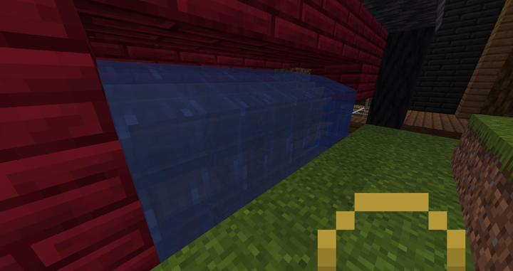
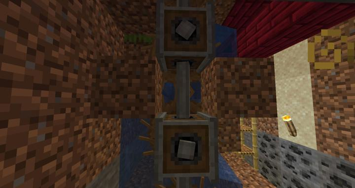

# Create 물레바퀴

초반 동력을 책임 졌던 물레바퀴이다
위에서 부터 물을 흘려보내서
총 4줄의 물레바퀴를 동시에 작동시키는 형태로 제작됨
철거했었지만 다시 설치해서 사진을 찍는다 

### 참여자
<!-- player_desc_open -->
- [kidoxt](../members/kidoxt.md)  
기계 배치 설계 및 제작
<!-- player_desc_close-->