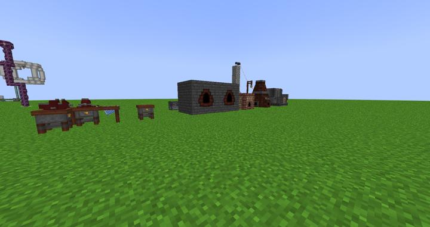
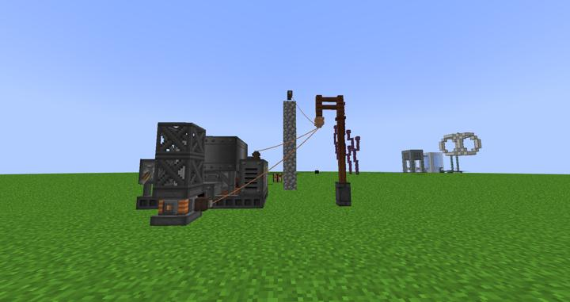
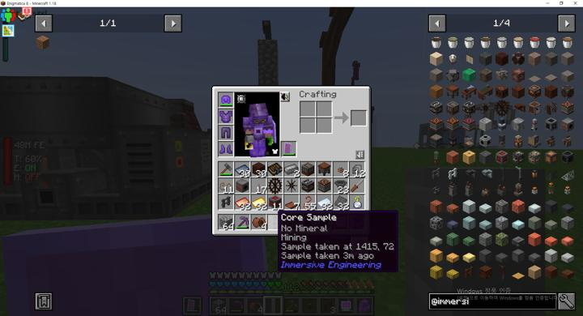
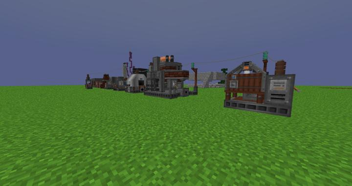

# 이머시브 엔지니어링 - 전시관

이미 발전할거 다 된 상태에서 시작하는 이머시브 엔지니어링.

사실상 전시관이나 다름없다.

마이닝 차원에서 시작한 Immersive Engineering
초반에 강철을 얻기 위해서 간단히 작동을 시키기도 했지만 본격적으로 취미로 시작해보았다
특유의 멀티블럭이 멋져서 써보는 맛은 있다
지금은 단순히 오븐과 합금 용광로 및 강화용광로, 크러셔, 코어 샘플 드릴만 설치해서 작동시켜봤다

예전에는 발전을 하기 위해 풍차와 수차를 설치하거나 석유발전기를 설치해야했지만 지금은 다른 발전기 전기를 끌어올 수 있어서 아주 편하다

:::warning
마이닝 차원에서는 이머시브 엔지니어링 채굴기로 자원은 캘 수 없는 듯하다
:::

### 2023-05-09 추가

어셈블러 : 사람이 제작하는 대부분을 제작할 수 있는 제작기계
아크 퍼니스 : 대용량 용광로 메카니즘 용광로가 더 빠르고 효율이 높아서 쓸 일은 없을 것이다
스퀴즈 : 짜내는 기계 Plant Oil를 만들지만 쓸 곳은 이머시브 발전기 외에는 쓸 곳이 딱히 없다

이머시브 엔지니어링용 수차 하지만 크기가 크고 효율도 좋은편은 아니다

### 위치
<!-- tag_source_open:link_list:building_spot -->
- 마이닝 디멘션
<!-- tag_close -->

### 참여자
<!-- tag_source_open:link_list:member_contribute -->
- [kidoxt](../members/kidoxt.md)  
박물관 제작
<!-- tag_close-->
