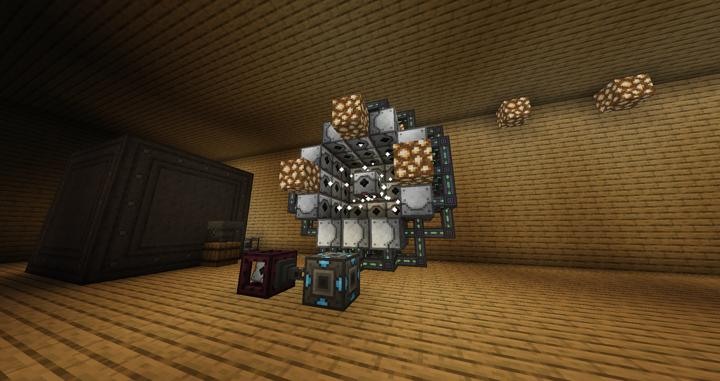
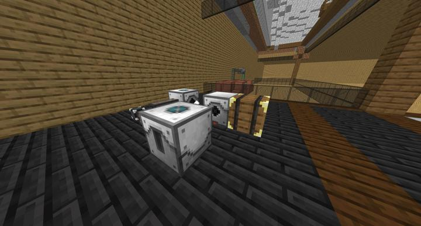

# 레이저 드릴

에너지를 사용해서 광물을 생성하는 최종 테크

핵 분열로 이상의 수준으로 에너지가 넘쳐나기 시작하면, 반드시 에너지를 사용할 곳을 찾게 마련이다.  
레이저 드릴은 에너지를 사용해서 광물을 허공에서 만들어내는 시스템이다. 
안에 넣은 레이저 렌즈의 색깔, 드릴 베이스를 놓은 바이옴과 차원, 설정한 y좌표 높이에 따라서 다른 광물 확률 분포를 가진다. 

현재 총 5면, 9개의 블럭씩 해서 45개의 레이저 드릴이 있다.  
각각에는 전부 Efficiency, Progress, Speed 2티어 최고 업그레이드를 넣었고
Entagled 블럭을 사용하여 내부에 귀찮은 전선을 치웠다. 

렌즈는 일단 Brown 1개, lightblue 3개, yellow 2개로 세팅했다.  
주로 생산하는 광물 비율은 철 > 금 > 다이아몬드 순이다. 

:::tip
생산되는 모든 광물은 전부 RS main으로 빨려들어가지만, [블랙홀 룸](rs_black_hole.md)에서 안정적으로 자원을 보관하고 있으므로 창고가 터질 위험성은 없다.
:::
### 예전의 모습

처음에 소박하게 시작했던 레이저 드릴의 모습
이 상태로 일주일 넘게 방치되어 있었다.

### 참여자
<!-- player_desc_open -->
- [jasuk500](../members/jasuk500.md)  
기계 배치 및 제작
- [BANJUHARA](../members/BANJUHARA.md)  
최초 시작
- [happyjourney](../members/happyjourney.md)  
주변 공간 데코
<!-- player_desc_close-->