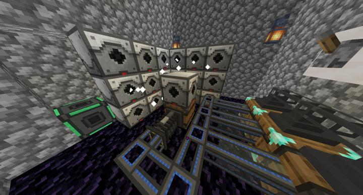

# 네더 레이저 드릴

네더 바이옴에서 가중치가 높은 특정 광물들을 핀포인트로 채굴하기 위한 레이저 드릴

우라늄, 플루오린, 네더 석영, 고대 잔해를 필터링해 스위치로 메인 RS 시스템으로 전송한다.

물론 텔레포터로 접근 가능

## 업데이트 내역
### 2023-06-04 건설 완료

:::details 사진들
레이저 드릴 전체 모습  

:::

## 타 문서와의 관계
### 위치
<!-- tag_source_open:link_list:building_spot -->
-  네더 
<!-- tag_close -->

### 참여자
<!-- tag_source_open:link_list:member_contribute -->
- [BANJUHARA](../members/BANJUHARA.md)    
최초 시작, 기계 배치, 네트워크 연결
<!-- tag_close-->

네더 마이너 : 네더 바이옴에서 가중치가 높은 특정 광물들을 핀포인트로 채굴하기 위한 레이저 드릴. 우라늄, 플루오린, 네더 석영, 고대 잔해를 필터링해 스위치로 메인 RS 시스템으로 전송한다.

