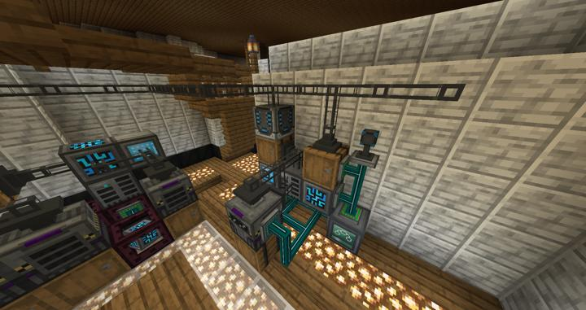

# 메카니즘 자동 컴프레싱 머신

RS에 연결된 자동 컴프레싱 머신들

사용 횟수가 많지 않아서 싱글 코어로 충분하다 생각된다.

대신 엘리트 팩토리로 달아놨다.

## 타 문서와의 관계
### 위치
<!-- tag_source_open:link_list:building_spot -->
- [연구소 - 메카](../buildings/lab_meka_lab.md)
<!-- tag_close -->

### 참여자
<!-- tag_source_open:link_list:member_contribute -->
- [jasuk500](../members/jasuk500.md)  
시스템 설계 및 제작
<!-- tag_close-->