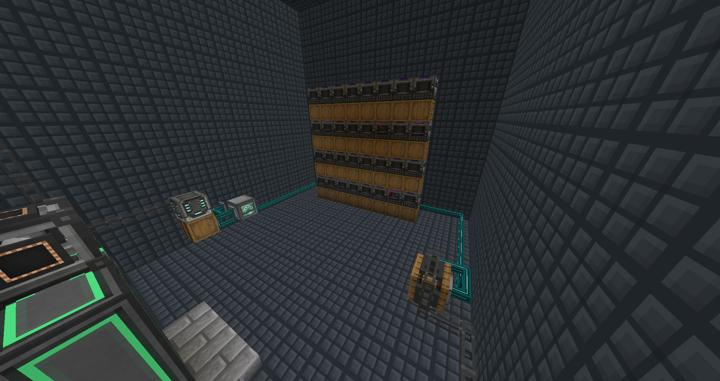
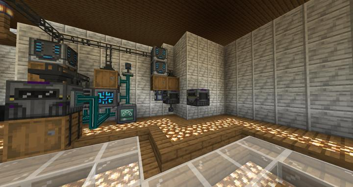

# 메카니즘 자동 병렬 크러셔

32*9개의 크러셔로 1000개의 아이템을 8초안에 처리한다.

32개의 엘리트 크러셔를 병렬로 연결하여 아이템들을 순식간에 처리한다. 

RS 네트워크에 연결되어 있으며, 주로 조약돌->자갈->모래 순으로 대량 확보하기 위해 제작되었다. 
피크 속도는 초당 약 200개 가량의 아이템을 처리하며, XNet의 세팅을 세심하게 조정하여 효율을 높였다.

:::tip
XNet에서 input 상자에서 템을 크러셔들로 라우팅 할 때, 아이템 수량을 9의 배수로 뽑아내게 하고, 라우팅 방법은 round robin, 5ms, order로 세팅한다.
:::

## 업데이트 내역
### 2023-05-06 대량 병렬 처리 패치 

이전  
이전에는 1코어로 초당 6개 정도의 아이템을 처리했다.

이후

## 타 문서와의 관계
### 위치
<!-- tag_source_open:link_list:building_spot -->
- [컴팩트 머신 차원](../buildings/compact_machine_dimension.md)  
288스레드의 대형 공정이 위치함.
- [연구소 - 메카](../buildings/lab_meka_lab.md)  
지금은 컴팩트 머신 차원으로 옮겨졌다.
<!-- tag_close -->

### 참여자
<!-- tag_source_open:link_list:member_contribute -->
- [jasuk500](../members/jasuk500.md)  
시스템 설계 및 제작
<!-- tag_close-->