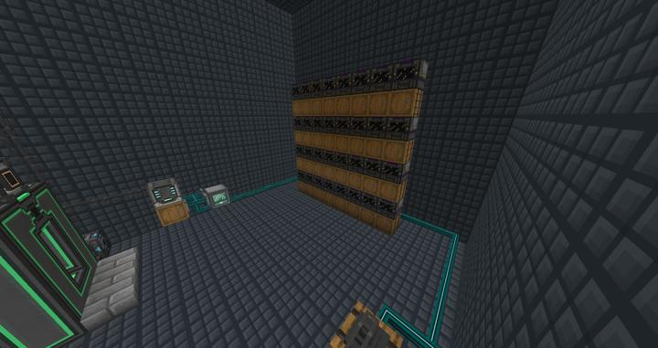

# 메카니즘 자동 인리치멘트 체임버

RS에 연결되어 자동으로 병렬 처리하는데 사용된다.

### 기계 구성

현재 최고 티어 Elite Factory 1대로 사용하고 있다.

전력, 아이템 파이핑은 전부 XNet을 사용하여 관리하고 있다.

:::tip
메카니즘의 factory들은 병렬 처리에 뛰어나지만 대신 출력 슬롯이 여러개이다.  
XNet의 아이템 파이핑은 아이템 슬롯을 순회하여 동작하므로, 추후에 기계가 수십대가 붙으면 아이템 출력 속도가 생산 속도를 따라가지 못하게 된다.  

따라서 각 기계 아래에 barrel 등으로 아이템 버퍼를 만든 다음, 각 기계에서 해당 방향으로 auto-eject를 사용하여 차지하는 아이템 슬롯의 개수를 줄이는 것이 좋다.
:::

### 참여자
<!-- tag_source_open:link_list:member_contribute -->
- [jasuk500](../members/jasuk500.md)  
자동화 라인 설계 및 제작
- [BANJUHARA](../members/BANJUHARA.md)  
초기 자동화 라인 개발 참여
- [happyjourney](../members/happyjourney.md)  
주변 공간 데코
<!-- tag_close-->