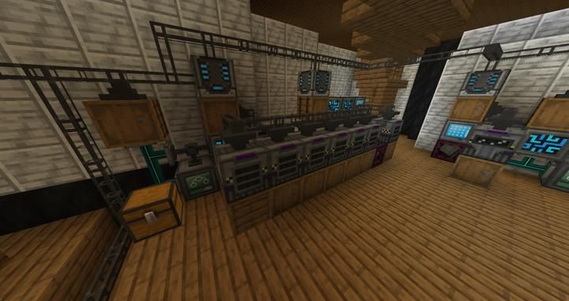
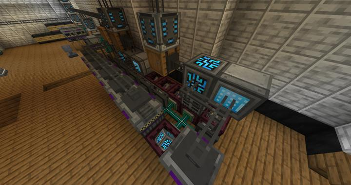
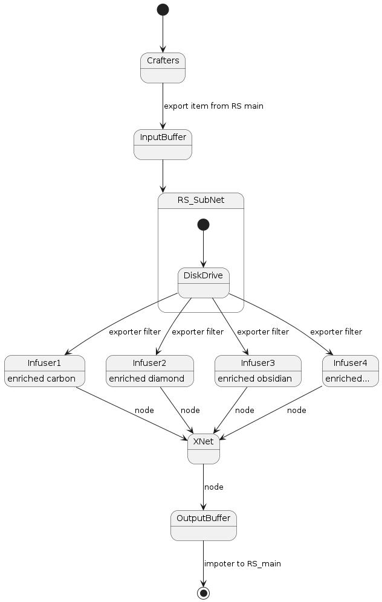

# 메카니즘 자동 메탈러직 인퓨져

RS 시스템에 연결되어 자동으로 병렬처리하는데 사용된다.

전력, 아이템 파이핑을 XNet &  RS로 따로 담당하였다. 

:::warning
병렬 자동화를 시도할 시, 여러개의 아이템을 동시에 요구하는 레시피는 자동화가 까다롭다.
:::

## 아이템 pair-typed 조합법에 대한 자동 병렬 처리 문제

메털러직 인퓨져는 조합법 자체가 아이템이 쌍으로 이루어진다.

Enriched carbon 1개 + iron8개 = 결과물 8개 이런 식이다.
이를 무작정 input buffer에 넣고 일괄적으로 XNet을 사용하기에는 채널 수도 모자라고, 유지보수성도 급격하게 떨어진다.

특히, 서로 겹치는 재료를 가진 조합법을 동시에 시도하면 높은 확률로 자기들끼리 아이템이 꼬여서 전체가 막혀버리는 일이 종종 발생한다. 또한, input buffer에 내부 공간이 크지 않은 경우, 더이상 크래프터에서 재료 아이템이 미처 나오지 못하여 조합이 먹통이 되는 경우도 있다.

따라서, input buffer를 다시 sub RS 네트워크에 넣은 후, 각각에 재료가 겹치지 않도록 Exporter를 잘 사용하여 여러대의 기계에 개별적으로 연결한다. 
물론 기계에서 처리가 완료된 부분은 다시 XNet을 통해 output buffer로 연결되고, 이는 다시 메인 RS 시스템으로 빨려들어간다.  
RS를 사용하기 때문에 input buffer의 용량이 얼마든지 확장될 수 있으며, 필터 개수 또한 무한정으로 늘어날 수 있다.

이를 표현하면 다음과 같다.

:::tip Future Work
공간상의 이유로 Entangled 블럭을 남용하긴 했지만, 추후에 더 큰 공간으로 이사갈 때 깔끔하게 정리될 것이다.
:::

## 타 문서와의 관계
### 위치
<!-- tag_source_open:link_list:building_spot -->
- [연구소 - 메카](../buildings/lab_meka_lab.md)
<!-- tag_close -->

### 참여자
<!-- tag_source_open:link_list:member_contribute -->
- [jasuk500](../members/jasuk500.md)  
자동화 라인 설계 및 제작
- [BANJUHARA](../members/BANJUHARA.md)  
초기 자동화 라인 개발 참여
<!-- tag_close-->