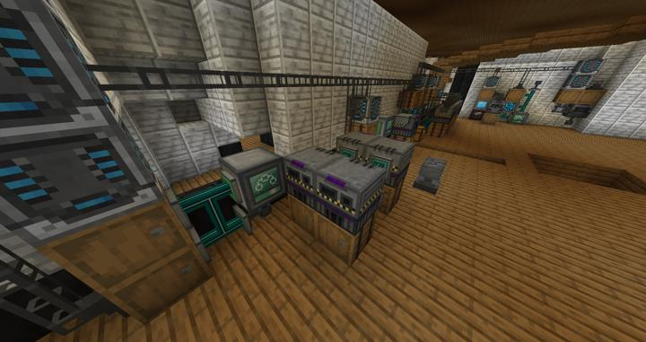

# 메카니즘 자동 병렬 스멜터

32*9개의 쓰레드로 수천개의 아이템을 1분내에 구울 수 있다.

스멜터의 모든 조합법은 단일 입력, 단일 출력 방식이므로 XNet을 사용하여 쉽게 자동화할 수 있다.
현재 32개의 Elite Smeltery factory 블럭이 연결되어 있다.

:::tip
XNet은 전력, 아이템, 유체까지 전부 node만 연결되어있다면 통신이 가능하므로, 이런 협소한 공간에서 매우 좋다. 
XNet 컨트롤러를 통한 파이핑 중앙화, 서버 친화적인 모드로 렉 유발도 적다.
:::

## 연결 구조

Xnet을 통해 다음과 같이 라우팅된다.

## 업데이트 내역
### 2023-05-06 대량 병렬 처리를 위해 32*9스레드 구조로 변경됨

이전

이후

## 타 문서와의 관계
### 위치
<!-- tag_source_open:link_list:building_spot -->
- [컴팩트 머신 차원](../buildings/compact_machine_dimension.md)  
288스레드의 대형 공정이 위치해있다.
- [연구소 - 메카](../buildings/lab_meka_lab.md)  
지금은 규모가 커져 컴팩트 머신 차원으로 옮겨졌다.
<!-- tag_close -->

### 참여자
<!-- tag_source_open:link_list:member_contribute -->
- [jasuk500](../members/jasuk500.md)  
자동화 라인 설계 및 제작
- [BANJUHARA](../members/BANJUHARA.md)  
초기 자동화 라인 개발 참여
<!-- tag_close-->