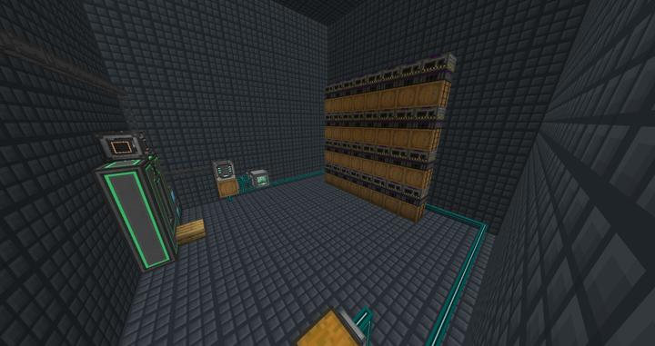
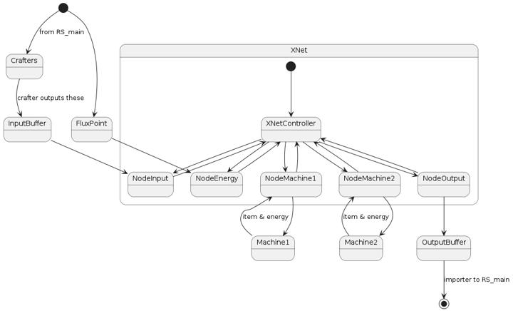

# 메카니즘 자동 스멜터 프로세서

RS 시스템에서 자동 스멜팅에 사용하는 병렬 스멜터리 그룹.

스멜터의 모든 조합법은 단일 입력, 단일 출력 방식이므로 XNet을 사용하여 쉽게 자동화할 수 있다.\
현재 4개의 Elite Smeltery factort 블럭이 연결되어 있다.

:::tip
XNet은 전력, 아이템, 유체까지 전부 node만 연결되어있다면 통신이 가능하므로, 이런 협소한 공간에서 매우 좋다. 
XNet 컨트롤러를 통한 파이핑 중앙화, 서버 친화적인 모드로 렉 유발도 적다.
:::

### 연결 구조

Xnet을 통해 다음과 같이 라우팅된다.

:::warning
현재 RS에서 제공되는 기본 Crafter의 아이템 출력 속도가 너무 느려, 지금 달려있는 모든 스멜터를 풀가동 시킬 수 없다.  
:::

:::tip Future Work
이에 Extra Storage 애드온을 깔아 상위 티어의 Crafter를 사용함으로써 이 아이템 처리 병목이 해결될 수 있다.
:::

### 위치
<!-- tag_source_open:link_list:building_spot -->
- [연구소 - 메카](../buildings/lab_meka_lab.md)
<!-- tag_close -->

### 참여자
<!-- tag_source_open:link_list:member_contribute -->
- [jasuk500](../members/jasuk500.md)  
자동화 라인 설계 및 제작
- [BANJUHARA](../members/BANJUHARA.md)  
초기 자동화 라인 개발 참여
<!-- tag_close-->