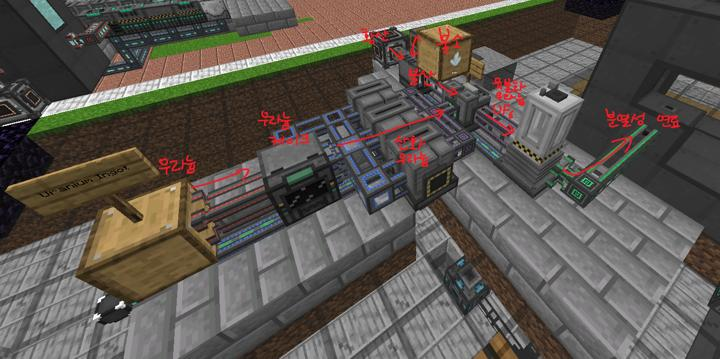
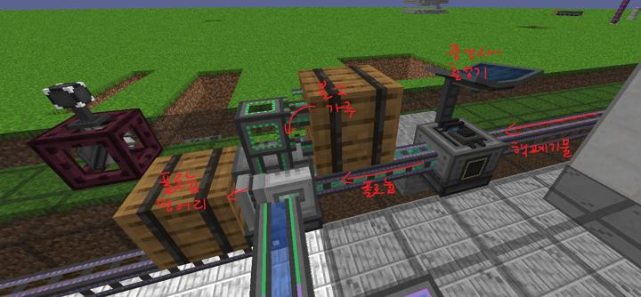

# 메카니즘 핵 분열로

메카니즘 모드의 대량 에너지 생산 시설이다.

<!-- tag_target_open:frame:energy_generation_generations -->
:::tip 에너지 생산 시스템 변천사
화력 발전 -> [바이오(에틸렌) 발전](../systems/mk_ethylene_generator.md) -> [핵분열 원자로](../systems/mk_fission_reactor.md) -> [핵융합 원자로](../systems/mk_fusion_reactor.md)
:::
<!-- tag_close -->

결핍으로부터의 해방이라는 관점에선 핵융합로가 메카니즘의 엔드게임이라 볼 수 있으며, 핵분열로는 그 마지막 관문이다. 

틱당 최대 30mB의 핵연료를 사용할 수 있으며, 이 때의 발전량은 틱당 약 80만이다. 발전량만 보면 그냥 가스발전기 12대가 발전량, 안전성, 영구성, 난이도까지 다 씹어먹어버리지만 메카니즘의 마지막 컨텐츠들에 쓸 수 있는 핵 부산물을 얻을 수 있다는 점이 핵심이다.

핵분열로 운용에 있어 가장 까다로운 점은 크게 4가지가 있으며, 다음과 같은 방법으로 극복했다.
1. 만드는게 지랄맞다 : 황산 제조 라인을 별도로 분리한 덕에 Fissile Fuel 제조 공정을 엄청나게 단축시킬 수 있었다.

2. 연료를 계속 넣어줘야 한다 : Fissile Fuel을 보관할 수 있는 엄청난 용량의 다이내믹 탱크를 배치해서 연료의 원재료를 최대한 빠르게 처리한 뒤 탱크에 보관하는 방식을 사용했다. 덕분에 재료를 뭉탱이로 넣은 뒤 보관량-사용량을 저울질해서 관리가 비교적 쉽도록 했다. 현실적으로 채우는 건 불가능하지만, 탱크가 연료로 가득하다면 최대 발전량, 정상 틱레이트로도 원자로 가동을 현실 시간으로 18.5일간 유지할 수 있다.

3. 전기가 꽉 차면 터빈이 중지되고, 냉각수 순환이 멈춰 핵분열로가 터진다 : 저번 엔데버 서버에서 원자로를 한 번 날려먹었던 원인으로, 원자로 멜트다운의 가장 주된 원인이다. 위험 수준으로 원자로의 온도가 올라가면 작동을 멈추도록 간단한 회로를 배치했다.

4. 핵융합로만들면 이딴거다필요없는데ㅋㅋ : 팩트사용자를 서버에서 밴 처리하였다.

### Fissile Fule 제작 공정  

issile Fuel 제작 공정. 우라늄과 불소(Fluorite)가 지속적으로 필요하다.
에너지 발전에는 더이상 필요없으나 핵폐기물 가공품이 필요하기에 재료 확보에 신경써야 한다.
우라늄은 네더의 레이저 드릴로 확보할 수 있으니 네더 석영도 얻을 겸 겸사겸사 지을 예정
이것 역시 미리 분리해둔 황산 제조라인의 도움을 받았다.

### 핵폐기물 가공 공정

중성자 활성기 대신 동위원소 원심분리기를 사용하면 똑같은 공정으로 폴로늄 대신 플루토늄을 얻을 수 있으나 폴로늄이 훨씬 많이 필요하기에 우선순위에서는 밀린 상태이다.

### 2023-05-07 효율 개선

황산 제조공정에 불필요한 병목 및 비효율이 관측되어서 조약돌 생성량을 2배로, 공장들의 성능을 1티어에서 3티어로 2.33배 업그레이드했다. 조약돌 생성량이 살짝 못 따라가고는 있으나, 그 이후 공정에서 용납할만한 가벼운 병목이 발생해 생산량의 밸런스가 조절되는 중.
무작정 황산 생산량만 늘리는 게 능사는 아닌 게, 중간 부산물 또한 다른 곳에 사용되고 있으므로 밸런스가 중요하다

### 위치
<!-- tag_source_open:link_list:building_spot -->
- 마이닝 디멘션
<!-- tag_close -->

### 참여자
<!-- tag_source_open:link_list:member_contribute -->
- [BANJUHARA](../members/BANJUHARA.md)  
핵 분열로 설계 및 제작 / 유지보수
<!-- tag_close-->
