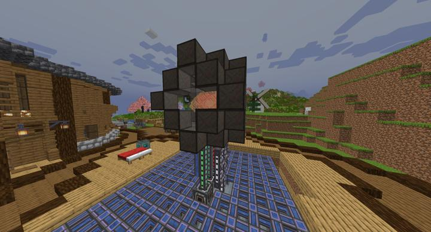
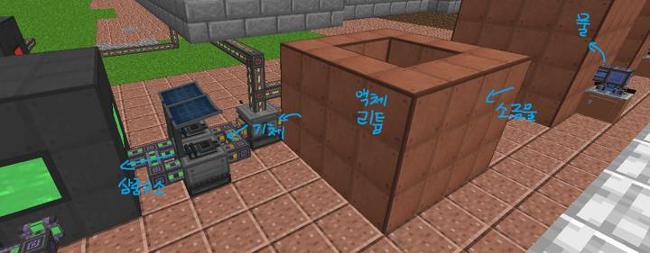
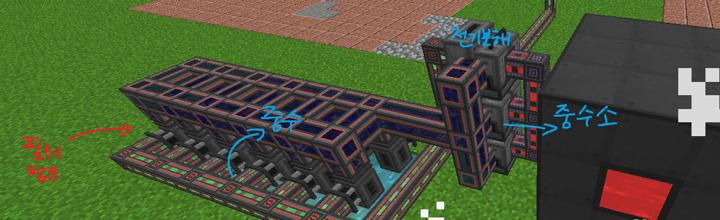
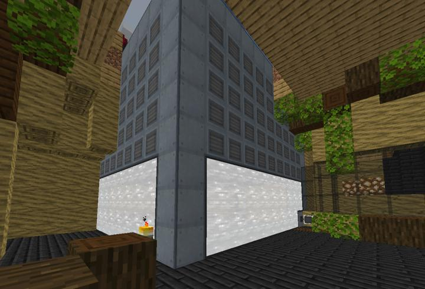

# 메카니즘 핵 융합로

에너지 제약으로부터의 해방

<!-- tag_target_open:frame:energy_generation_generations -->
:::tip 에너지 생산 시스템 변천사
화력 발전 -> [바이오(에틸렌) 발전](../systems/mk_ethylene_generator.md) -> [핵분열 원자로](../systems/mk_fission_reactor.md) -> [핵융합 원자로](../systems/mk_fusion_reactor.md)
:::
<!-- tag_close -->

핵융합로. 왼쪽부터 냉각수, 중수소, 패시브 발전 부산 전력, 삼중수소, 냉각수가 기화된 증기 파이프이다. 막대한 열을 발생시키는 핵융합로도 결국 물을 끓여 터빈을 돌리는 개웃긴 현실고증.

삼중수소를 제작하는 과정이다. 기체 리튬을 중성자와 반응시켜 트리튬을 만드는 공정은 현실반영이라더라.

중수소를 제작하는 과정이다. 중수를 전기분해해서 중수소를 만드는 단순한 공정.

냉각수를 다 기화시키지 못하고 남은 열은 융합로에서 자체적으로 전기로 바꾸게 된다(패시브 발전). 이게 된다는 건 터빈이 없어도 발전이 가능하다는 뜻이지만, 발전량 효율 차이가 엄청나게 크므로 터빈도 써주기로 했다.

핵율합로에 붙어있는 터빈. 엄청나게 클 필요가 있어서 땅 속까지도 깊게 묻혀있다.

## 타 문서와의 관계
### 위치
<!-- tag_source_open:link_list:building_spot -->
- 길드 주변
- 길드 지하 2층
<!-- tag_close -->

### 참여자
<!-- tag_source_open:link_list:member_contribute -->
- [BANJUHARA](../members/BANJUHARA.md)  
핵 융합로 설계 제작 및 유지보수
<!-- tag_close-->
