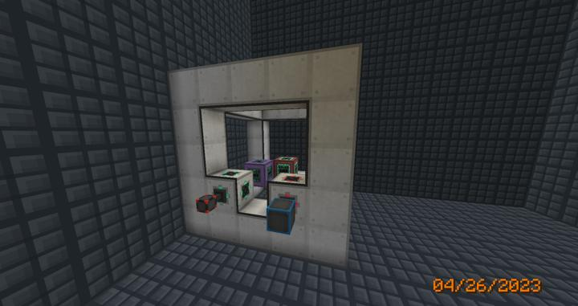
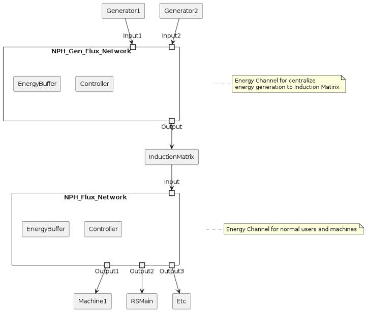
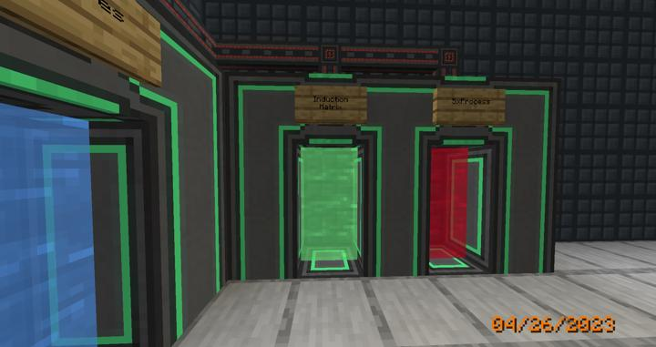

# 메카니즘 인덕션 메트릭스

확장성 좋은 대량 에너지 저장 멀티블럭.

멀티블럭 구조는 어떤 에너지 저장량을 요구해도 유연하게 대처할 수 있는 좋은 방식이다.  
에너지 저장량은 에너지 사용량과, 비상시에 에너지를 얼마나 버팉 수 있느냐와도 직결되는 문제이므로 큰 에너지 저장소를 확보하는것은 기술모드 전반에 있어서 매우 중요한 문제이다.

이와같은 중요 시설은 반드시 보호되어야 하므로, 현재 컴팩트 머신 차원에 위치해 있으며
텔레포터 허브에 다음과 같이 연결되어 있다.  

### 에너지 파이프라인

Flux Network를 사용하여 전력이 이동하며, NPH_Gen 라인으로부터 입력을 받고, NPH라인을 통해 각 기계로 전달된다.
다이어그램은 다음과 같다

### 장소

현재 컴팩트 머신 차원을 할당하여 동작하고 있으며,  
텔레포터 허브를 통해 이동할 수 있다.

### 참여자
<!-- player_desc_open -->
- [BANJUHARA](../members/BANJUHARA.md)  
유도 매트릭스 규모 산정 / 설계 및 제작 / 유지보수
- [jasuk500](../members/jasuk500.md)  
텔레포터 배치
<!-- player_desc_close-->