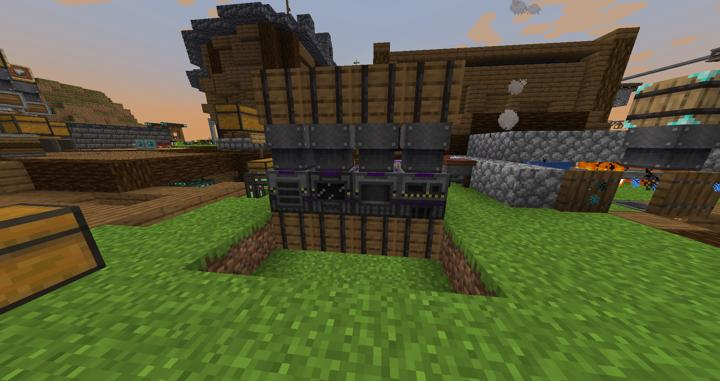
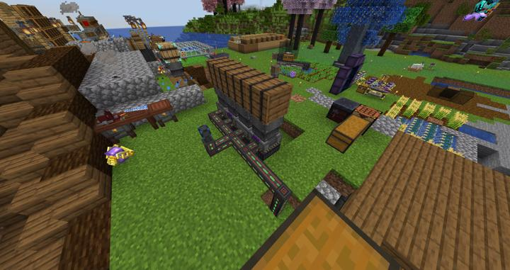

# 메카니즘 수동 프로세서들

수동으로 메카니즘의 각종 프로세싱을 하기 위한 공간이다.

**이곳에서 기술모드가 처음 시작됐다.**

바이오 연료를 사용한 발전과, 모든 전기를 사용하는 시설이 한때는 저곳에 있었다.

현재도 역사를 기념하기 위해 메인길드의 바로 옆 마당에 자리잡고 있다.

### 참여자
<!-- player_desc_open -->
- [BANJUHARA](../members/BANJUHARA.md)  
기계 배치 및 파이프라인 설계 / 제작
<!-- player_desc_close-->