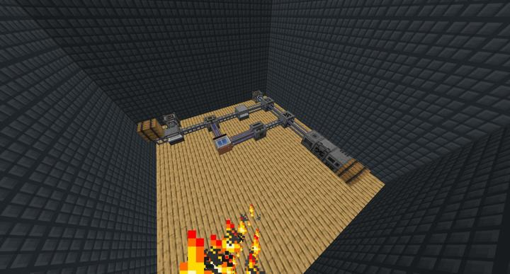
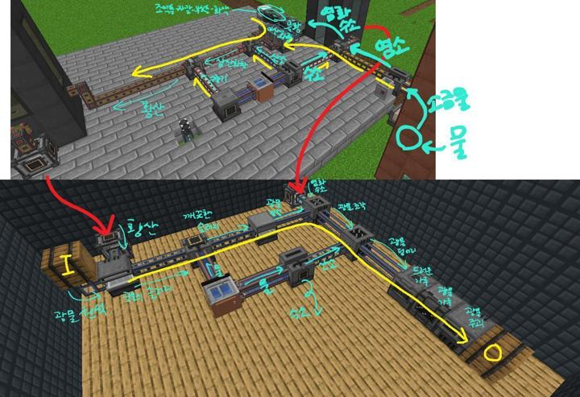

# 광물 가공 플랜트

황산과 염화수소는 외부에 지은 황산 제조공정에서 긴빠이해서 사용하는 덕분에 굉장히 간소해짐

<!-- tag_target_open:frame:ore_refinement_generations -->
:::tip 광물 정제 시스템 변천사
화로 -> [수동 2배 공정](mk_manual_processors.md)-> [자동 5배 공정](mk_ore_processing_plant.md) -> 대형 병렬 자동 4배 공정
:::
<!-- tag_close -->

가공 다이어그램은 다음과 같다:

### 위치
<!-- tag_source_open:link_list:building_spot -->
- 컴팩트 머신 차원
<!-- tag_close -->

### 참여자
<!-- tag_source_open:link_list:member_contribute -->
- [BANJUHARA](../members/BANJUHARA.md)  
파이프라인 설계 및 제작 / 유지보수
- [jasuk500](../members/jasuk500.md)  
텔레포터 배치
<!-- tag_close-->