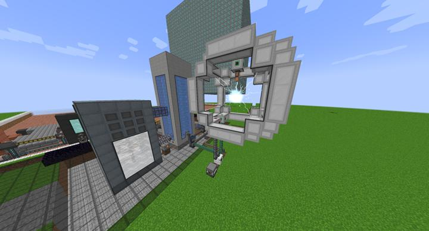
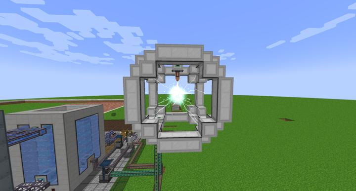

# 메카니즘 초임계 상변환기

메카니즘의 최종 목적, 반물질 입자 생성기

Mekanism의 엔드컨텐츠인 초임계 상변환 시스템. 핵폐기물을 중성자 활성기로 처리한 폴로늄에 대량의 전기를 공급해 반물질을 만드는 시설이다.

용도가 다양하지는 않지만 강력한 최종 테크 조합법에 쓰이기 때문에 핵융합 이후에 지어줘야 하는 시설이다. 일반적인 핵폐기물 처리 공정이 남기는 찌꺼기인 Spent Nuclear Waste조차 없이 손도 깔끔으로 마무리해주는 공정.

핵분열 이후에 바로 올릴 수도 있지만 전기 소모량이 핵융합 없이 감당될 수준이 아니다.

정면샷

## 타 문서와의 관계
### 위치
<!-- tag_source_open:link_list:building_spot -->
- 마이닝 디멘션
<!-- tag_close -->

### 참여자
<!-- tag_source_open:link_list:member_contribute -->
- [BANJUHARA](../members/BANJUHARA.md)  
공정 설계 및 제작
<!-- tag_close-->