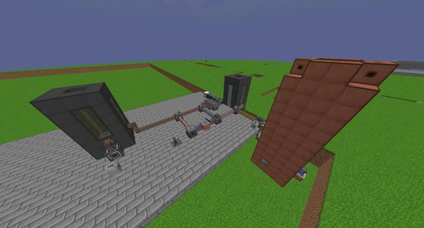
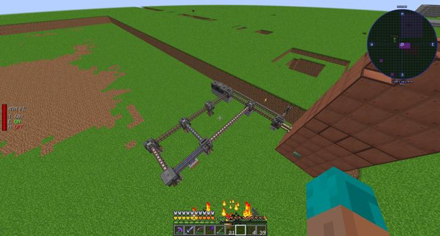

# 메카니즘 황산 플랜트

물과 조약돌을 가공해 황산을 만드는 공정단지임. 전기 공급은 아래쪽으로 빼서 손도 깔끔

한때 이랬지만, 지금은 롤백 사태 이후로 사라짐.

### 위치
<!-- tag_source_open:link_list:building_spot -->
- 마이닝 디멘션
<!-- tag_close -->

### 참여자
<!-- tag_source_open:link_list:member_contribute -->
- [BANJUHARA](../members/BANJUHARA.md)  
파이프라인 설계 및 제작
<!-- tag_close-->